# Projects and dependencies analysis

This document provides a comprehensive overview of the projects and their dependencies in the context of upgrading to .NETCoreApp,Version=v10.0.

## Table of Contents

- [Executive Summary](#executive-Summary)
  - [Highlevel Metrics](#highlevel-metrics)
  - [Projects Compatibility](#projects-compatibility)
  - [Package Compatibility](#package-compatibility)
  - [API Compatibility](#api-compatibility)
- [Aggregate NuGet packages details](#aggregate-nuget-packages-details)
- [Top API Migration Challenges](#top-api-migration-challenges)
  - [Technologies and Features](#technologies-and-features)
  - [Most Frequent API Issues](#most-frequent-api-issues)
- [Projects Relationship Graph](#projects-relationship-graph)
- [Project Details](#project-details)

  - [docs\concepts\elicitation\samples\client\ElicitationClient.csproj](#docsconceptselicitationsamplesclientelicitationclientcsproj)
  - [docs\concepts\elicitation\samples\server\Elicitation.csproj](#docsconceptselicitationsamplesserverelicitationcsproj)
  - [docs\concepts\httpcontext\samples\HttpContext.csproj](#docsconceptshttpcontextsampleshttpcontextcsproj)
  - [docs\concepts\logging\samples\client\LoggingClient.csproj](#docsconceptsloggingsamplesclientloggingclientcsproj)
  - [docs\concepts\logging\samples\server\Logging.csproj](#docsconceptsloggingsamplesserverloggingcsproj)
  - [docs\concepts\progress\samples\client\ProgressClient.csproj](#docsconceptsprogresssamplesclientprogressclientcsproj)
  - [docs\concepts\progress\samples\server\Progress.csproj](#docsconceptsprogresssamplesserverprogresscsproj)
  - [samples\AspNetCoreMcpPerSessionTools\AspNetCoreMcpPerSessionTools.csproj](#samplesaspnetcoremcppersessiontoolsaspnetcoremcppersessiontoolscsproj)
  - [samples\AspNetCoreMcpServer\AspNetCoreMcpServer.csproj](#samplesaspnetcoremcpserveraspnetcoremcpservercsproj)
  - [samples\ChatWithTools\ChatWithTools.csproj](#sampleschatwithtoolschatwithtoolscsproj)
  - [samples\EverythingServer\EverythingServer.csproj](#sampleseverythingservereverythingservercsproj)
  - [samples\InMemoryTransport\InMemoryTransport.csproj](#samplesinmemorytransportinmemorytransportcsproj)
  - [samples\LongRunningTasks\LongRunningTasks.csproj](#sampleslongrunningtaskslongrunningtaskscsproj)
  - [samples\ProtectedMcpClient\ProtectedMcpClient.csproj](#samplesprotectedmcpclientprotectedmcpclientcsproj)
  - [samples\ProtectedMcpServer\ProtectedMcpServer.csproj](#samplesprotectedmcpserverprotectedmcpservercsproj)
  - [samples\QuickstartClient\QuickstartClient.csproj](#samplesquickstartclientquickstartclientcsproj)
  - [samples\QuickstartWeatherServer\QuickstartWeatherServer.csproj](#samplesquickstartweatherserverquickstartweatherservercsproj)
  - [samples\TestServerWithHosting\TestServerWithHosting.csproj](#samplestestserverwithhostingtestserverwithhostingcsproj)
  - [src\ModelContextProtocol.Analyzers\ModelContextProtocol.Analyzers.csproj](#srcmodelcontextprotocolanalyzersmodelcontextprotocolanalyzerscsproj)
  - [src\ModelContextProtocol.AspNetCore\ModelContextProtocol.AspNetCore.csproj](#srcmodelcontextprotocolaspnetcoremodelcontextprotocolaspnetcorecsproj)
  - [src\ModelContextProtocol.Core\ModelContextProtocol.Core.csproj](#srcmodelcontextprotocolcoremodelcontextprotocolcorecsproj)
  - [src\ModelContextProtocol\ModelContextProtocol.csproj](#srcmodelcontextprotocolmodelcontextprotocolcsproj)
  - [tests\ModelContextProtocol.Analyzers.Tests\ModelContextProtocol.Analyzers.Tests.csproj](#testsmodelcontextprotocolanalyzerstestsmodelcontextprotocolanalyzerstestscsproj)
  - [tests\ModelContextProtocol.AotCompatibility.TestApp\ModelContextProtocol.AotCompatibility.TestApp.csproj](#testsmodelcontextprotocolaotcompatibilitytestappmodelcontextprotocolaotcompatibilitytestappcsproj)
  - [tests\ModelContextProtocol.AspNetCore.Tests\ModelContextProtocol.AspNetCore.Tests.csproj](#testsmodelcontextprotocolaspnetcoretestsmodelcontextprotocolaspnetcoretestscsproj)
  - [tests\ModelContextProtocol.ConformanceClient\ModelContextProtocol.ConformanceClient.csproj](#testsmodelcontextprotocolconformanceclientmodelcontextprotocolconformanceclientcsproj)
  - [tests\ModelContextProtocol.ConformanceServer\ModelContextProtocol.ConformanceServer.csproj](#testsmodelcontextprotocolconformanceservermodelcontextprotocolconformanceservercsproj)
  - [tests\ModelContextProtocol.ExperimentalApiRegressionTest\ModelContextProtocol.ExperimentalApiRegressionTest.csproj](#testsmodelcontextprotocolexperimentalapiregressiontestmodelcontextprotocolexperimentalapiregressiontestcsproj)
  - [tests\ModelContextProtocol.TestOAuthServer\ModelContextProtocol.TestOAuthServer.csproj](#testsmodelcontextprotocoltestoauthservermodelcontextprotocoltestoauthservercsproj)
  - [tests\ModelContextProtocol.Tests\ModelContextProtocol.Tests.csproj](#testsmodelcontextprotocoltestsmodelcontextprotocoltestscsproj)
  - [tests\ModelContextProtocol.TestServer\ModelContextProtocol.TestServer.csproj](#testsmodelcontextprotocoltestservermodelcontextprotocoltestservercsproj)
  - [tests\ModelContextProtocol.TestSseServer\ModelContextProtocol.TestSseServer.csproj](#testsmodelcontextprotocoltestsseservermodelcontextprotocoltestsseservercsproj)

## Executive Summary

### Highlevel Metrics

| Metric | Count | Status |
| :--- | :---: | :--- |
| Total Projects | 32 | 30 require upgrade |
| Total NuGet Packages | 38 | 11 need upgrade |
| Total Code Files | 654 |  |
| Total Code Files with Incidents | 143 |  |
| Total Lines of Code | 100022 |  |
| Total Number of Issues | 1116 |  |
| Estimated LOC to modify | 1065+ | at least 1.1% of codebase |

### Projects Compatibility

| Project | Target Framework | Difficulty | Package Issues | API Issues | Est. LOC Impact | Description |
| :--- | :---: | :---: | :---: | :---: | :---: | :--- |
| [docs\concepts\elicitation\samples\client\ElicitationClient.csproj](#docsconceptselicitationsamplesclientelicitationclientcsproj) | net9.0 | 🟢 Low | 0 | 3 | 3+ | DotNetCoreApp, Sdk Style = True |
| [docs\concepts\elicitation\samples\server\Elicitation.csproj](#docsconceptselicitationsamplesserverelicitationcsproj) | net9.0 | 🟢 Low | 0 | 1 | 1+ | AspNetCore, Sdk Style = True |
| [docs\concepts\httpcontext\samples\HttpContext.csproj](#docsconceptshttpcontextsampleshttpcontextcsproj) | net9.0 | 🟢 Low | 0 | 1 | 1+ | AspNetCore, Sdk Style = True |
| [docs\concepts\logging\samples\client\LoggingClient.csproj](#docsconceptsloggingsamplesclientloggingclientcsproj) | net9.0 | 🟢 Low | 0 | 3 | 3+ | DotNetCoreApp, Sdk Style = True |
| [docs\concepts\logging\samples\server\Logging.csproj](#docsconceptsloggingsamplesserverloggingcsproj) | net9.0 | 🟢 Low | 0 | 0 |  | AspNetCore, Sdk Style = True |
| [docs\concepts\progress\samples\client\ProgressClient.csproj](#docsconceptsprogresssamplesclientprogressclientcsproj) | net9.0 | 🟢 Low | 0 | 3 | 3+ | DotNetCoreApp, Sdk Style = True |
| [docs\concepts\progress\samples\server\Progress.csproj](#docsconceptsprogresssamplesserverprogresscsproj) | net9.0 | 🟢 Low | 0 | 1 | 1+ | AspNetCore, Sdk Style = True |
| [samples\AspNetCoreMcpPerSessionTools\AspNetCoreMcpPerSessionTools.csproj](#samplesaspnetcoremcppersessiontoolsaspnetcoremcppersessiontoolscsproj) | net9.0 | 🟢 Low | 0 | 0 |  | AspNetCore, Sdk Style = True |
| [samples\AspNetCoreMcpServer\AspNetCoreMcpServer.csproj](#samplesaspnetcoremcpserveraspnetcoremcpservercsproj) | net9.0 | 🟢 Low | 0 | 9 | 9+ | AspNetCore, Sdk Style = True |
| [samples\ChatWithTools\ChatWithTools.csproj](#sampleschatwithtoolschatwithtoolscsproj) | net8.0 | 🟢 Low | 0 | 0 |  | DotNetCoreApp, Sdk Style = True |
| [samples\EverythingServer\EverythingServer.csproj](#sampleseverythingservereverythingservercsproj) | net9.0 | 🟢 Low | 0 | 0 |  | AspNetCore, Sdk Style = True |
| [samples\InMemoryTransport\InMemoryTransport.csproj](#samplesinmemorytransportinmemorytransportcsproj) | net8.0 | 🟢 Low | 0 | 0 |  | DotNetCoreApp, Sdk Style = True |
| [samples\LongRunningTasks\LongRunningTasks.csproj](#sampleslongrunningtaskslongrunningtaskscsproj) | net9.0 | 🟢 Low | 0 | 3 | 3+ | AspNetCore, Sdk Style = True |
| [samples\ProtectedMcpClient\ProtectedMcpClient.csproj](#samplesprotectedmcpclientprotectedmcpclientcsproj) | net9.0 | 🟢 Low | 1 | 12 | 12+ | DotNetCoreApp, Sdk Style = True |
| [samples\ProtectedMcpServer\ProtectedMcpServer.csproj](#samplesprotectedmcpserverprotectedmcpservercsproj) | net9.0 | 🟢 Low | 1 | 20 | 20+ | AspNetCore, Sdk Style = True |
| [samples\QuickstartClient\QuickstartClient.csproj](#samplesquickstartclientquickstartclientcsproj) | net8.0 | 🟢 Low | 1 | 3 | 3+ | DotNetCoreApp, Sdk Style = True |
| [samples\QuickstartWeatherServer\QuickstartWeatherServer.csproj](#samplesquickstartweatherserverquickstartweatherservercsproj) | net8.0 | 🟢 Low | 1 | 8 | 8+ | DotNetCoreApp, Sdk Style = True |
| [samples\TestServerWithHosting\TestServerWithHosting.csproj](#samplestestserverwithhostingtestserverwithhostingcsproj) | net10.0;net9.0;net8.0;net472 | 🟢 Low | 1 | 0 |  | DotNetCoreApp, Sdk Style = True |
| [src\ModelContextProtocol.Analyzers\ModelContextProtocol.Analyzers.csproj](#srcmodelcontextprotocolanalyzersmodelcontextprotocolanalyzerscsproj) | netstandard2.0 | ✅ None | 0 | 0 |  | ClassLibrary, Sdk Style = True |
| [src\ModelContextProtocol.AspNetCore\ModelContextProtocol.AspNetCore.csproj](#srcmodelcontextprotocolaspnetcoremodelcontextprotocolaspnetcorecsproj) | net10.0;net9.0;net8.0 | 🟢 Low | 0 | 10 | 10+ | ClassLibrary, Sdk Style = True |
| [src\ModelContextProtocol.Core\ModelContextProtocol.Core.csproj](#srcmodelcontextprotocolcoremodelcontextprotocolcorecsproj) | net10.0;net9.0;net8.0;netstandard2.0 | 🟢 Low | 1 | 233 | 233+ | ClassLibrary, Sdk Style = True |
| [src\ModelContextProtocol\ModelContextProtocol.csproj](#srcmodelcontextprotocolmodelcontextprotocolcsproj) | net10.0;net9.0;net8.0;netstandard2.0 | 🟢 Low | 2 | 0 |  | ClassLibrary, Sdk Style = True |
| [tests\ModelContextProtocol.Analyzers.Tests\ModelContextProtocol.Analyzers.Tests.csproj](#testsmodelcontextprotocolanalyzerstestsmodelcontextprotocolanalyzerstestscsproj) | net9.0 | 🟢 Low | 0 | 0 |  | DotNetCoreApp, Sdk Style = True |
| [tests\ModelContextProtocol.AotCompatibility.TestApp\ModelContextProtocol.AotCompatibility.TestApp.csproj](#testsmodelcontextprotocolaotcompatibilitytestappmodelcontextprotocolaotcompatibilitytestappcsproj) | net10.0 | ✅ None | 0 | 0 |  | DotNetCoreApp, Sdk Style = True |
| [tests\ModelContextProtocol.AspNetCore.Tests\ModelContextProtocol.AspNetCore.Tests.csproj](#testsmodelcontextprotocolaspnetcoretestsmodelcontextprotocolaspnetcoretestscsproj) | net10.0;net9.0;net8.0 | 🟢 Low | 4 | 509 | 509+ | DotNetCoreApp, Sdk Style = True |
| [tests\ModelContextProtocol.ConformanceClient\ModelContextProtocol.ConformanceClient.csproj](#testsmodelcontextprotocolconformanceclientmodelcontextprotocolconformanceclientcsproj) | net10.0;net9.0;net8.0 | 🟢 Low | 1 | 13 | 13+ | DotNetCoreApp, Sdk Style = True |
| [tests\ModelContextProtocol.ConformanceServer\ModelContextProtocol.ConformanceServer.csproj](#testsmodelcontextprotocolconformanceservermodelcontextprotocolconformanceservercsproj) | net10.0;net9.0;net8.0 | 🟢 Low | 0 | 0 |  | AspNetCore, Sdk Style = True |
| [tests\ModelContextProtocol.ExperimentalApiRegressionTest\ModelContextProtocol.ExperimentalApiRegressionTest.csproj](#testsmodelcontextprotocolexperimentalapiregressiontestmodelcontextprotocolexperimentalapiregressiontestcsproj) | net10.0;net9.0;net8.0 | 🟢 Low | 0 | 0 |  | ClassLibrary, Sdk Style = True |
| [tests\ModelContextProtocol.TestOAuthServer\ModelContextProtocol.TestOAuthServer.csproj](#testsmodelcontextprotocoltestoauthservermodelcontextprotocoltestoauthservercsproj) | net10.0;net9.0;net8.0 | 🟢 Low | 0 | 44 | 44+ | AspNetCore, Sdk Style = True |
| [tests\ModelContextProtocol.Tests\ModelContextProtocol.Tests.csproj](#testsmodelcontextprotocoltestsmodelcontextprotocoltestscsproj) | net10.0;net9.0;net8.0;net472 | 🟢 Low | 3 | 187 | 187+ | DotNetCoreApp, Sdk Style = True |
| [tests\ModelContextProtocol.TestServer\ModelContextProtocol.TestServer.csproj](#testsmodelcontextprotocoltestservermodelcontextprotocoltestservercsproj) | net10.0;net9.0;net8.0;net472 | 🟢 Low | 5 | 1 | 1+ | DotNetCoreApp, Sdk Style = True |
| [tests\ModelContextProtocol.TestSseServer\ModelContextProtocol.TestSseServer.csproj](#testsmodelcontextprotocoltestsseservermodelcontextprotocoltestsseservercsproj) | net10.0;net9.0;net8.0 | 🟢 Low | 0 | 1 | 1+ | AspNetCore, Sdk Style = True |

### Package Compatibility

| Status | Count | Percentage |
| :--- | :---: | :---: |
| ✅ Compatible | 27 | 71.1% |
| ⚠️ Incompatible | 0 | 0.0% |
| 🔄 Upgrade Recommended | 11 | 28.9% |
| ***Total NuGet Packages*** | ***38*** | ***100%*** |

### API Compatibility

| Category | Count | Impact |
| :--- | :---: | :--- |
| 🔴 Binary Incompatible | 9 | High - Require code changes |
| 🟡 Source Incompatible | 198 | Medium - Needs re-compilation and potential conflicting API error fixing |
| 🔵 Behavioral change | 858 | Low - Behavioral changes that may require testing at runtime |
| ✅ Compatible | 113138 |  |
| ***Total APIs Analyzed*** | ***114203*** |  |

## Aggregate NuGet packages details

| Package | Current Version | Suggested Version | Projects | Description |
| :--- | :---: | :---: | :--- | :--- |
| Anthropic | 12.17.0 |  | [QuickstartClient.csproj](#samplesquickstartclientquickstartclientcsproj) | ✅Compatible |
| coverlet.collector | 10.0.0 |  | [ModelContextProtocol.Analyzers.Tests.csproj](#testsmodelcontextprotocolanalyzerstestsmodelcontextprotocolanalyzerstestscsproj) [ModelContextProtocol.AspNetCore.Tests.csproj](#testsmodelcontextprotocolaspnetcoretestsmodelcontextprotocolaspnetcoretestscsproj) [ModelContextProtocol.Tests.csproj](#testsmodelcontextprotocoltestsmodelcontextprotocoltestscsproj) | ✅Compatible |
| JsonSchema.Net | 9.2.0 |  | [ModelContextProtocol.Tests.csproj](#testsmodelcontextprotocoltestsmodelcontextprotocoltestscsproj) | ✅Compatible |
| Microsoft.AspNetCore.Authentication.JwtBearer | 10.0.7 | 10.0.8 | [ModelContextProtocol.AspNetCore.Tests.csproj](#testsmodelcontextprotocolaspnetcoretestsmodelcontextprotocolaspnetcoretestscsproj) | NuGet package upgrade is recommended |
| Microsoft.AspNetCore.Authentication.JwtBearer | 9.0.11 | 10.0.8 | [ProtectedMcpServer.csproj](#samplesprotectedmcpserverprotectedmcpservercsproj) | NuGet package upgrade is recommended |
| Microsoft.CodeAnalysis.Analyzers | 3.3.4 |  | [ModelContextProtocol.Analyzers.csproj](#srcmodelcontextprotocolanalyzersmodelcontextprotocolanalyzerscsproj) [ModelContextProtocol.Analyzers.Tests.csproj](#testsmodelcontextprotocolanalyzerstestsmodelcontextprotocolanalyzerstestscsproj) | ✅Compatible |
| Microsoft.CodeAnalysis.CSharp | 4.8.0 |  | [ModelContextProtocol.Analyzers.csproj](#srcmodelcontextprotocolanalyzersmodelcontextprotocolanalyzerscsproj) [ModelContextProtocol.Analyzers.Tests.csproj](#testsmodelcontextprotocolanalyzerstestsmodelcontextprotocolanalyzerstestscsproj) | ✅Compatible |
| Microsoft.Extensions.AI | 10.5.2 |  | [ChatWithTools.csproj](#sampleschatwithtoolschatwithtoolscsproj) [ModelContextProtocol.AspNetCore.Tests.csproj](#testsmodelcontextprotocolaspnetcoretestsmodelcontextprotocolaspnetcoretestscsproj) [ModelContextProtocol.Tests.csproj](#testsmodelcontextprotocoltestsmodelcontextprotocoltestscsproj) [QuickstartClient.csproj](#samplesquickstartclientquickstartclientcsproj) | ✅Compatible |
| Microsoft.Extensions.AI.Abstractions | 10.5.2 |  | [ModelContextProtocol.Core.csproj](#srcmodelcontextprotocolcoremodelcontextprotocolcorecsproj) | ✅Compatible |
| Microsoft.Extensions.AI.OpenAI | 10.5.2 |  | [ChatWithTools.csproj](#sampleschatwithtoolschatwithtoolscsproj) [ModelContextProtocol.AspNetCore.Tests.csproj](#testsmodelcontextprotocolaspnetcoretestsmodelcontextprotocolaspnetcoretestscsproj) [ModelContextProtocol.Tests.csproj](#testsmodelcontextprotocoltestsmodelcontextprotocoltestscsproj) | ✅Compatible |
| Microsoft.Extensions.Caching.Abstractions | 10.0.7 | 10.0.8 | [ModelContextProtocol.csproj](#srcmodelcontextprotocolmodelcontextprotocolcsproj) | NuGet package upgrade is recommended |
| Microsoft.Extensions.Caching.Memory | 10.0.7 | 10.0.8 | [ModelContextProtocol.AspNetCore.Tests.csproj](#testsmodelcontextprotocolaspnetcoretestsmodelcontextprotocolaspnetcoretestscsproj) [ModelContextProtocol.Tests.csproj](#testsmodelcontextprotocoltestsmodelcontextprotocoltestscsproj) | NuGet package upgrade is recommended |
| Microsoft.Extensions.DependencyInjection | 10.0.7 | 10.0.8 | [ModelContextProtocol.TestServer.csproj](#testsmodelcontextprotocoltestservermodelcontextprotocoltestservercsproj) | NuGet package upgrade is recommended |
| Microsoft.Extensions.Hosting | 10.0.7 | 10.0.8 | [ModelContextProtocol.TestServer.csproj](#testsmodelcontextprotocoltestservermodelcontextprotocoltestservercsproj) [QuickstartClient.csproj](#samplesquickstartclientquickstartclientcsproj) [QuickstartWeatherServer.csproj](#samplesquickstartweatherserverquickstartweatherservercsproj) [TestServerWithHosting.csproj](#samplestestserverwithhostingtestserverwithhostingcsproj) | NuGet package upgrade is recommended |
| Microsoft.Extensions.Hosting.Abstractions | 10.0.7 | 10.0.8 | [ModelContextProtocol.csproj](#srcmodelcontextprotocolmodelcontextprotocolcsproj) | NuGet package upgrade is recommended |
| Microsoft.Extensions.Logging | 10.0.7 | 10.0.8 | [ModelContextProtocol.AspNetCore.Tests.csproj](#testsmodelcontextprotocolaspnetcoretestsmodelcontextprotocolaspnetcoretestscsproj) [ModelContextProtocol.Tests.csproj](#testsmodelcontextprotocoltestsmodelcontextprotocoltestscsproj) [ModelContextProtocol.TestServer.csproj](#testsmodelcontextprotocoltestservermodelcontextprotocoltestservercsproj) | NuGet package upgrade is recommended |
| Microsoft.Extensions.Logging.Abstractions | 10.0.7 | 10.0.8 | [ModelContextProtocol.Core.csproj](#srcmodelcontextprotocolcoremodelcontextprotocolcorecsproj) | NuGet package upgrade is recommended |
| Microsoft.Extensions.Logging.Console | 10.0.7 | 10.0.8 | [ModelContextProtocol.AspNetCore.Tests.csproj](#testsmodelcontextprotocolaspnetcoretestsmodelcontextprotocolaspnetcoretestscsproj) [ModelContextProtocol.ConformanceClient.csproj](#testsmodelcontextprotocolconformanceclientmodelcontextprotocolconformanceclientcsproj) [ModelContextProtocol.Tests.csproj](#testsmodelcontextprotocoltestsmodelcontextprotocoltestscsproj) [ModelContextProtocol.TestServer.csproj](#testsmodelcontextprotocoltestservermodelcontextprotocoltestservercsproj) [ProtectedMcpClient.csproj](#samplesprotectedmcpclientprotectedmcpclientcsproj) | NuGet package upgrade is recommended |
| Microsoft.Extensions.Options | 10.0.7 | 10.0.8 | [ModelContextProtocol.TestServer.csproj](#testsmodelcontextprotocoltestservermodelcontextprotocoltestservercsproj) | NuGet package upgrade is recommended |
| Microsoft.Extensions.TimeProvider.Testing | 10.1.0 |  | [ModelContextProtocol.AspNetCore.Tests.csproj](#testsmodelcontextprotocolaspnetcoretestsmodelcontextprotocolaspnetcoretestscsproj) [ModelContextProtocol.Tests.csproj](#testsmodelcontextprotocoltestsmodelcontextprotocoltestscsproj) | ✅Compatible |
| Microsoft.NET.Test.Sdk | 18.5.1 |  | [ModelContextProtocol.Analyzers.Tests.csproj](#testsmodelcontextprotocolanalyzerstestsmodelcontextprotocolanalyzerstestscsproj) [ModelContextProtocol.AspNetCore.Tests.csproj](#testsmodelcontextprotocolaspnetcoretestsmodelcontextprotocolaspnetcoretestscsproj) [ModelContextProtocol.Tests.csproj](#testsmodelcontextprotocoltestsmodelcontextprotocoltestscsproj) | ✅Compatible |
| Microsoft.SourceLink.GitHub | 8.0.0 |  | [ModelContextProtocol.Analyzers.csproj](#srcmodelcontextprotocolanalyzersmodelcontextprotocolanalyzerscsproj) [ModelContextProtocol.AspNetCore.csproj](#srcmodelcontextprotocolaspnetcoremodelcontextprotocolaspnetcorecsproj) [ModelContextProtocol.Core.csproj](#srcmodelcontextprotocolcoremodelcontextprotocolcorecsproj) [ModelContextProtocol.csproj](#srcmodelcontextprotocolmodelcontextprotocolcsproj) | ✅Compatible |
| Moq | 4.20.72 |  | [ModelContextProtocol.AspNetCore.Tests.csproj](#testsmodelcontextprotocolaspnetcoretestsmodelcontextprotocolaspnetcoretestscsproj) [ModelContextProtocol.Tests.csproj](#testsmodelcontextprotocoltestsmodelcontextprotocoltestscsproj) | ✅Compatible |
| NETStandard.Library | 2.0.3 |  | [ModelContextProtocol.Analyzers.csproj](#srcmodelcontextprotocolanalyzersmodelcontextprotocolanalyzerscsproj) | ✅Compatible |
| OpenTelemetry | 1.15.3 |  | [AspNetCoreMcpPerSessionTools.csproj](#samplesaspnetcoremcppersessiontoolsaspnetcoremcppersessiontoolscsproj) [AspNetCoreMcpServer.csproj](#samplesaspnetcoremcpserveraspnetcoremcpservercsproj) [ChatWithTools.csproj](#sampleschatwithtoolschatwithtoolscsproj) [EverythingServer.csproj](#sampleseverythingservereverythingservercsproj) [ModelContextProtocol.AspNetCore.Tests.csproj](#testsmodelcontextprotocolaspnetcoretestsmodelcontextprotocolaspnetcoretestscsproj) [ModelContextProtocol.Tests.csproj](#testsmodelcontextprotocoltestsmodelcontextprotocoltestscsproj) | ✅Compatible |
| OpenTelemetry.Exporter.InMemory | 1.15.3 |  | [ModelContextProtocol.AspNetCore.Tests.csproj](#testsmodelcontextprotocolaspnetcoretestsmodelcontextprotocolaspnetcoretestscsproj) [ModelContextProtocol.Tests.csproj](#testsmodelcontextprotocoltestsmodelcontextprotocoltestscsproj) | ✅Compatible |
| OpenTelemetry.Exporter.OpenTelemetryProtocol | 1.15.3 |  | [AspNetCoreMcpServer.csproj](#samplesaspnetcoremcpserveraspnetcoremcpservercsproj) [ChatWithTools.csproj](#sampleschatwithtoolschatwithtoolscsproj) [EverythingServer.csproj](#sampleseverythingservereverythingservercsproj) | ✅Compatible |
| OpenTelemetry.Extensions.Hosting | 1.15.3 |  | [AspNetCoreMcpPerSessionTools.csproj](#samplesaspnetcoremcppersessiontoolsaspnetcoremcppersessiontoolscsproj) [AspNetCoreMcpServer.csproj](#samplesaspnetcoremcpserveraspnetcoremcpservercsproj) [EverythingServer.csproj](#sampleseverythingservereverythingservercsproj) | ✅Compatible |
| OpenTelemetry.Instrumentation.AspNetCore | 1.15.2 |  | [AspNetCoreMcpPerSessionTools.csproj](#samplesaspnetcoremcppersessiontoolsaspnetcoremcppersessiontoolscsproj) [AspNetCoreMcpServer.csproj](#samplesaspnetcoremcpserveraspnetcoremcpservercsproj) | ✅Compatible |
| OpenTelemetry.Instrumentation.Http | 1.15.1 |  | [AspNetCoreMcpPerSessionTools.csproj](#samplesaspnetcoremcppersessiontoolsaspnetcoremcppersessiontoolscsproj) [AspNetCoreMcpServer.csproj](#samplesaspnetcoremcpserveraspnetcoremcpservercsproj) [ChatWithTools.csproj](#sampleschatwithtoolschatwithtoolscsproj) [EverythingServer.csproj](#sampleseverythingservereverythingservercsproj) | ✅Compatible |
| Serilog | 4.3.1 |  | [ModelContextProtocol.Tests.csproj](#testsmodelcontextprotocoltestsmodelcontextprotocoltestscsproj) [ModelContextProtocol.TestServer.csproj](#testsmodelcontextprotocoltestservermodelcontextprotocoltestservercsproj) [TestServerWithHosting.csproj](#samplestestserverwithhostingtestserverwithhostingcsproj) | ✅Compatible |
| Serilog.Extensions.Hosting | 10.0.0 |  | [TestServerWithHosting.csproj](#samplestestserverwithhostingtestserverwithhostingcsproj) | ✅Compatible |
| Serilog.Extensions.Logging | 10.0.0 |  | [ModelContextProtocol.TestServer.csproj](#testsmodelcontextprotocoltestservermodelcontextprotocoltestservercsproj) [ModelContextProtocol.TestSseServer.csproj](#testsmodelcontextprotocoltestsseservermodelcontextprotocoltestsseservercsproj) | ✅Compatible |
| Serilog.Sinks.Console | 6.1.1 |  | [TestServerWithHosting.csproj](#samplestestserverwithhostingtestserverwithhostingcsproj) | ✅Compatible |
| Serilog.Sinks.Debug | 3.0.0 |  | [TestServerWithHosting.csproj](#samplestestserverwithhostingtestserverwithhostingcsproj) | ✅Compatible |
| Serilog.Sinks.File | 7.0.0 |  | [ModelContextProtocol.TestServer.csproj](#testsmodelcontextprotocoltestservermodelcontextprotocoltestservercsproj) [ModelContextProtocol.TestSseServer.csproj](#testsmodelcontextprotocoltestsseservermodelcontextprotocoltestsseservercsproj) [TestServerWithHosting.csproj](#samplestestserverwithhostingtestserverwithhostingcsproj) | ✅Compatible |
| xunit.runner.visualstudio | 3.1.5 |  | [ModelContextProtocol.Analyzers.Tests.csproj](#testsmodelcontextprotocolanalyzerstestsmodelcontextprotocolanalyzerstestscsproj) [ModelContextProtocol.AspNetCore.Tests.csproj](#testsmodelcontextprotocolaspnetcoretestsmodelcontextprotocolaspnetcoretestscsproj) [ModelContextProtocol.Tests.csproj](#testsmodelcontextprotocoltestsmodelcontextprotocoltestscsproj) | ✅Compatible |
| xunit.v3 | 3.2.2 |  | [ModelContextProtocol.Analyzers.Tests.csproj](#testsmodelcontextprotocolanalyzerstestsmodelcontextprotocolanalyzerstestscsproj) [ModelContextProtocol.AspNetCore.Tests.csproj](#testsmodelcontextprotocolaspnetcoretestsmodelcontextprotocolaspnetcoretestscsproj) [ModelContextProtocol.Tests.csproj](#testsmodelcontextprotocoltestsmodelcontextprotocoltestscsproj) | ✅Compatible |

## Top API Migration Challenges

### Technologies and Features

| Technology | Issues | Percentage | Migration Path |
| :--- | :---: | :---: | :--- |

### Most Frequent API Issues

| API | Count | Percentage | Category |
| :--- | :---: | :---: | :--- |
| T:System.Uri | 494 | 46.4% | Behavioral Change |
| M:System.Uri.#ctor(System.String) | 145 | 13.6% | Behavioral Change |
| T:System.Net.Http.HttpContent | 87 | 8.2% | Behavioral Change |
| M:System.TimeSpan.FromSeconds(System.Int64) | 66 | 6.2% | Source Incompatible |
| T:System.Text.Json.JsonDocument | 60 | 5.6% | Behavioral Change |
| M:System.TimeSpan.FromMinutes(System.Int64) | 37 | 3.5% | Source Incompatible |
| M:System.TimeSpan.FromHours(System.Int32) | 20 | 1.9% | Source Incompatible |
| M:System.Net.Http.HttpContent.ReadAsStreamAsync(System.Threading.CancellationToken) | 15 | 1.4% | Behavioral Change |
| T:Microsoft.AspNetCore.Authentication.JwtBearer.JwtBearerDefaults | 13 | 1.2% | Source Incompatible |
| F:Microsoft.AspNetCore.Authentication.JwtBearer.JwtBearerDefaults.AuthenticationScheme | 13 | 1.2% | Source Incompatible |
| M:System.Uri.#ctor(System.String,System.UriKind) | 11 | 1.0% | Behavioral Change |
| T:System.Net.ServerSentEvents.SseParser | 9 | 0.8% | Source Incompatible |
| P:System.Uri.AbsoluteUri | 9 | 0.8% | Behavioral Change |
| M:System.Net.ServerSentEvents.SseParser.Create(System.IO.Stream) | 7 | 0.7% | Source Incompatible |
| T:System.Linq.AsyncEnumerable | 7 | 0.7% | Binary Incompatible |
| P:System.Diagnostics.ProcessStartInfo.Environment | 6 | 0.6% | Behavioral Change |
| P:Microsoft.AspNetCore.Authentication.JwtBearer.JwtBearerOptions.TokenValidationParameters | 6 | 0.6% | Source Incompatible |
| M:Microsoft.Extensions.Logging.ConsoleLoggerExtensions.AddConsole(Microsoft.Extensions.Logging.ILoggingBuilder,System.Action{Microsoft.Extensions.Logging.Console.ConsoleLoggerOptions}) | 5 | 0.5% | Behavioral Change |
| P:System.Uri.AbsolutePath | 5 | 0.5% | Behavioral Change |
| M:Microsoft.Extensions.Logging.ConsoleLoggerExtensions.AddConsole(Microsoft.Extensions.Logging.ILoggingBuilder) | 4 | 0.4% | Behavioral Change |
| P:Microsoft.AspNetCore.Authentication.JwtBearer.JwtBearerOptions.Authority | 3 | 0.3% | Source Incompatible |
| T:Microsoft.Extensions.DependencyInjection.JwtBearerExtensions | 3 | 0.3% | Source Incompatible |
| M:Microsoft.Extensions.DependencyInjection.JwtBearerExtensions.AddJwtBearer(Microsoft.AspNetCore.Authentication.AuthenticationBuilder,System.Action{Microsoft.AspNetCore.Authentication.JwtBearer.JwtBearerOptions}) | 3 | 0.3% | Source Incompatible |
| M:System.Uri.TryCreate(System.String,System.UriKind,System.Uri@) | 3 | 0.3% | Behavioral Change |
| M:System.Diagnostics.ActivitySource.StartActivity(System.String,System.Diagnostics.ActivityKind) | 3 | 0.3% | Behavioral Change |
| M:System.Text.Json.Serialization.Metadata.JsonTypeInfoResolver.Combine(System.ReadOnlySpan{System.Text.Json.Serialization.Metadata.IJsonTypeInfoResolver}) | 3 | 0.3% | Source Incompatible |
| M:Microsoft.Extensions.DependencyInjection.HttpClientFactoryServiceCollectionExtensions.AddHttpClient(Microsoft.Extensions.DependencyInjection.IServiceCollection,System.String,System.Action{System.Net.Http.HttpClient}) | 2 | 0.2% | Behavioral Change |
| M:Microsoft.Extensions.Configuration.ConfigurationBinder.Get''1(Microsoft.Extensions.Configuration.IConfiguration) | 2 | 0.2% | Binary Incompatible |
| P:Microsoft.AspNetCore.Authentication.JwtBearer.JwtBearerOptions.Backchannel | 2 | 0.2% | Source Incompatible |
| M:System.Uri.#ctor(System.Uri,System.String) | 2 | 0.2% | Behavioral Change |
| F:System.Net.ServerSentEvents.SseParser.EventTypeDefault | 2 | 0.2% | Source Incompatible |
| M:System.Text.Json.JsonSerializer.Deserialize(System.Text.Json.Utf8JsonReader@,System.Text.Json.Serialization.Metadata.JsonTypeInfo) | 2 | 0.2% | Behavioral Change |
| T:Microsoft.AspNetCore.Authentication.JwtBearer.JwtBearerEvents | 2 | 0.2% | Source Incompatible |
| M:System.Text.Json.JsonSerializer.Deserialize(System.Text.Json.Nodes.JsonNode,System.Text.Json.Serialization.Metadata.JsonTypeInfo) | 1 | 0.1% | Behavioral Change |
| M:System.TimeSpan.FromDays(System.Int32) | 1 | 0.1% | Source Incompatible |
| M:System.Text.Json.JsonSerializer.Deserialize(System.ReadOnlySpan{System.Char},System.Text.Json.Serialization.Metadata.JsonTypeInfo) | 1 | 0.1% | Behavioral Change |
| M:System.Text.Json.JsonSerializer.Deserialize(System.String,System.Text.Json.Serialization.Metadata.JsonTypeInfo) | 1 | 0.1% | Behavioral Change |
| M:System.TimeSpan.FromMilliseconds(System.Int64,System.Int64) | 1 | 0.1% | Source Incompatible |
| M:System.Diagnostics.ActivitySource.StartActivity(System.String,System.Diagnostics.ActivityKind,System.Diagnostics.ActivityContext,System.Collections.Generic.IEnumerable{System.Collections.Generic.KeyValuePair{System.String,System.Object}},System.Collections.Generic.IEnumerable{System.Diagnostics.ActivityLink},System.DateTimeOffset) | 1 | 0.1% | Behavioral Change |
| M:System.Threading.Tasks.Task.WhenAll(System.ReadOnlySpan{System.Threading.Tasks.Task}) | 1 | 0.1% | Source Incompatible |
| P:Microsoft.AspNetCore.Authentication.JwtBearer.JwtBearerEvents.OnChallenge | 1 | 0.1% | Source Incompatible |
| P:Microsoft.AspNetCore.Authentication.JwtBearer.AuthenticationFailedContext.Exception | 1 | 0.1% | Source Incompatible |
| P:Microsoft.AspNetCore.Authentication.JwtBearer.JwtBearerEvents.OnAuthenticationFailed | 1 | 0.1% | Source Incompatible |
| P:Microsoft.AspNetCore.Authentication.JwtBearer.JwtBearerEvents.OnTokenValidated | 1 | 0.1% | Source Incompatible |
| M:Microsoft.AspNetCore.Authentication.JwtBearer.JwtBearerEvents.#ctor | 1 | 0.1% | Source Incompatible |
| P:Microsoft.AspNetCore.Authentication.JwtBearer.JwtBearerOptions.Events | 1 | 0.1% | Source Incompatible |
| M:System.Net.Http.HttpContent.ReadAsStreamAsync | 1 | 0.1% | Behavioral Change |

## Projects Relationship Graph

Legend:
📦 SDK-style project
⚙️ Classic project

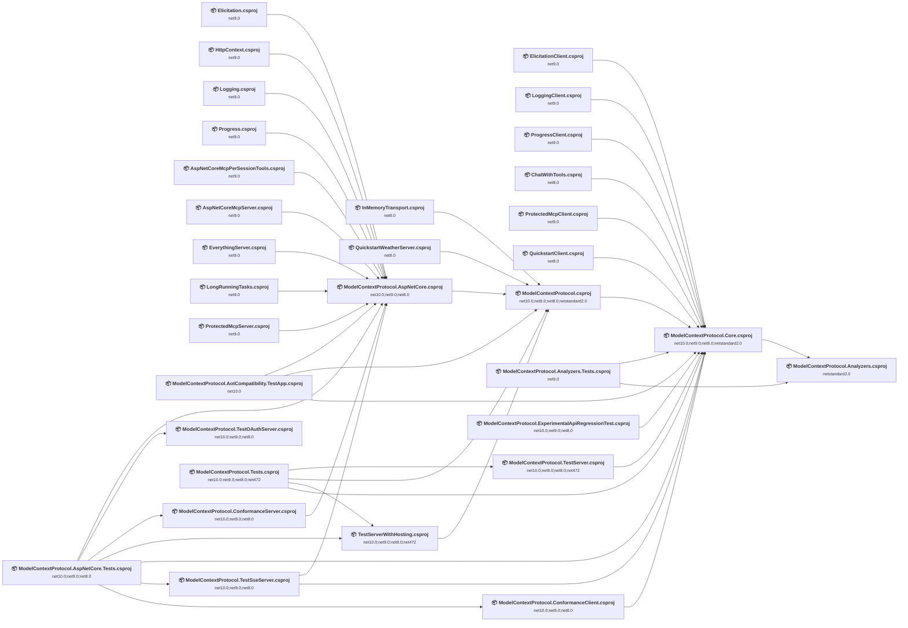
```mermaid
flowchart LR
    P1["<b>📦&nbsp;ElicitationClient.csproj</b><br/><small>net9.0</small>"]
    P2["<b>📦&nbsp;Elicitation.csproj</b><br/><small>net9.0</small>"]
    P3["<b>📦&nbsp;HttpContext.csproj</b><br/><small>net9.0</small>"]
    P4["<b>📦&nbsp;LoggingClient.csproj</b><br/><small>net9.0</small>"]
    P5["<b>📦&nbsp;Logging.csproj</b><br/><small>net9.0</small>"]
    P6["<b>📦&nbsp;ProgressClient.csproj</b><br/><small>net9.0</small>"]
    P7["<b>📦&nbsp;Progress.csproj</b><br/><small>net9.0</small>"]
    P8["<b>📦&nbsp;AspNetCoreMcpPerSessionTools.csproj</b><br/><small>net9.0</small>"]
    P9["<b>📦&nbsp;AspNetCoreMcpServer.csproj</b><br/><small>net9.0</small>"]
    P10["<b>📦&nbsp;ChatWithTools.csproj</b><br/><small>net8.0</small>"]
    P11["<b>📦&nbsp;EverythingServer.csproj</b><br/><small>net9.0</small>"]
    P12["<b>📦&nbsp;InMemoryTransport.csproj</b><br/><small>net8.0</small>"]
    P13["<b>📦&nbsp;LongRunningTasks.csproj</b><br/><small>net9.0</small>"]
    P14["<b>📦&nbsp;ProtectedMcpClient.csproj</b><br/><small>net9.0</small>"]
    P15["<b>📦&nbsp;ProtectedMcpServer.csproj</b><br/><small>net9.0</small>"]
    P16["<b>📦&nbsp;QuickstartClient.csproj</b><br/><small>net8.0</small>"]
    P17["<b>📦&nbsp;QuickstartWeatherServer.csproj</b><br/><small>net8.0</small>"]
    P18["<b>📦&nbsp;TestServerWithHosting.csproj</b><br/><small>net10.0;net9.0;net8.0;net472</small>"]
    P19["<b>📦&nbsp;ModelContextProtocol.Analyzers.csproj</b><br/><small>netstandard2.0</small>"]
    P20["<b>📦&nbsp;ModelContextProtocol.AspNetCore.csproj</b><br/><small>net10.0;net9.0;net8.0</small>"]
    P21["<b>📦&nbsp;ModelContextProtocol.Core.csproj</b><br/><small>net10.0;net9.0;net8.0;netstandard2.0</small>"]
    P22["<b>📦&nbsp;ModelContextProtocol.csproj</b><br/><small>net10.0;net9.0;net8.0;netstandard2.0</small>"]
    P23["<b>📦&nbsp;ModelContextProtocol.Analyzers.Tests.csproj</b><br/><small>net9.0</small>"]
    P24["<b>📦&nbsp;ModelContextProtocol.AotCompatibility.TestApp.csproj</b><br/><small>net10.0</small>"]
    P25["<b>📦&nbsp;ModelContextProtocol.AspNetCore.Tests.csproj</b><br/><small>net10.0;net9.0;net8.0</small>"]
    P26["<b>📦&nbsp;ModelContextProtocol.ConformanceClient.csproj</b><br/><small>net10.0;net9.0;net8.0</small>"]
    P27["<b>📦&nbsp;ModelContextProtocol.ConformanceServer.csproj</b><br/><small>net10.0;net9.0;net8.0</small>"]
    P28["<b>📦&nbsp;ModelContextProtocol.ExperimentalApiRegressionTest.csproj</b><br/><small>net10.0;net9.0;net8.0</small>"]
    P29["<b>📦&nbsp;ModelContextProtocol.TestOAuthServer.csproj</b><br/><small>net10.0;net9.0;net8.0</small>"]
    P30["<b>📦&nbsp;ModelContextProtocol.Tests.csproj</b><br/><small>net10.0;net9.0;net8.0;net472</small>"]
    P31["<b>📦&nbsp;ModelContextProtocol.TestServer.csproj</b><br/><small>net10.0;net9.0;net8.0;net472</small>"]
    P32["<b>📦&nbsp;ModelContextProtocol.TestSseServer.csproj</b><br/><small>net10.0;net9.0;net8.0</small>"]
    P1 --> P21
    P2 --> P20
    P3 --> P20
    P4 --> P21
    P5 --> P20
    P6 --> P21
    P7 --> P20
    P8 --> P20
    P9 --> P20
    P10 --> P21
    P11 --> P20
    P12 --> P22
    P13 --> P20
    P14 --> P21
    P15 --> P20
    P16 --> P21
    P17 --> P22
    P18 --> P22
    P20 --> P22
    P21 --> P19
    P22 --> P21
    P23 --> P19
    P23 --> P21
    P24 --> P21
    P24 --> P22
    P24 --> P20
    P25 --> P26
    P25 --> P32
    P25 --> P21
    P25 --> P18
    P25 --> P27
    P25 --> P29
    P25 --> P20
    P26 --> P21
    P27 --> P20
    P28 --> P21
    P30 --> P21
    P30 --> P18
    P30 --> P22
    P30 --> P31
    P31 --> P21
    P32 --> P21
    P32 --> P20
    click P1 "#docsconceptselicitationsamplesclientelicitationclientcsproj"
    click P2 "#docsconceptselicitationsamplesserverelicitationcsproj"
    click P3 "#docsconceptshttpcontextsampleshttpcontextcsproj"
    click P4 "#docsconceptsloggingsamplesclientloggingclientcsproj"
    click P5 "#docsconceptsloggingsamplesserverloggingcsproj"
    click P6 "#docsconceptsprogresssamplesclientprogressclientcsproj"
    click P7 "#docsconceptsprogresssamplesserverprogresscsproj"
    click P8 "#samplesaspnetcoremcppersessiontoolsaspnetcoremcppersessiontoolscsproj"
    click P9 "#samplesaspnetcoremcpserveraspnetcoremcpservercsproj"
    click P10 "#sampleschatwithtoolschatwithtoolscsproj"
    click P11 "#sampleseverythingservereverythingservercsproj"
    click P12 "#samplesinmemorytransportinmemorytransportcsproj"
    click P13 "#sampleslongrunningtaskslongrunningtaskscsproj"
    click P14 "#samplesprotectedmcpclientprotectedmcpclientcsproj"
    click P15 "#samplesprotectedmcpserverprotectedmcpservercsproj"
    click P16 "#samplesquickstartclientquickstartclientcsproj"
    click P17 "#samplesquickstartweatherserverquickstartweatherservercsproj"
    click P18 "#samplestestserverwithhostingtestserverwithhostingcsproj"
    click P19 "#srcmodelcontextprotocolanalyzersmodelcontextprotocolanalyzerscsproj"
    click P20 "#srcmodelcontextprotocolaspnetcoremodelcontextprotocolaspnetcorecsproj"
    click P21 "#srcmodelcontextprotocolcoremodelcontextprotocolcorecsproj"
    click P22 "#srcmodelcontextprotocolmodelcontextprotocolcsproj"
    click P23 "#testsmodelcontextprotocolanalyzerstestsmodelcontextprotocolanalyzerstestscsproj"
    click P24 "#testsmodelcontextprotocolaotcompatibilitytestappmodelcontextprotocolaotcompatibilitytestappcsproj"
    click P25 "#testsmodelcontextprotocolaspnetcoretestsmodelcontextprotocolaspnetcoretestscsproj"
    click P26 "#testsmodelcontextprotocolconformanceclientmodelcontextprotocolconformanceclientcsproj"
    click P27 "#testsmodelcontextprotocolconformanceservermodelcontextprotocolconformanceservercsproj"
    click P28 "#testsmodelcontextprotocolexperimentalapiregressiontestmodelcontextprotocolexperimentalapiregressiontestcsproj"
    click P29 "#testsmodelcontextprotocoltestoauthservermodelcontextprotocoltestoauthservercsproj"
    click P30 "#testsmodelcontextprotocoltestsmodelcontextprotocoltestscsproj"
    click P31 "#testsmodelcontextprotocoltestservermodelcontextprotocoltestservercsproj"
    click P32 "#testsmodelcontextprotocoltestsseservermodelcontextprotocoltestsseservercsproj"

```

## Project Details

### docs\concepts\elicitation\samples\client\ElicitationClient.csproj

#### Project Info

- **Current Target Framework:** net9.0
- **Proposed Target Framework:** net10.0
- **SDK-style**: True
- **Project Kind:** DotNetCoreApp
- **Dependencies**: 1
- **Dependants**: 0
- **Number of Files**: 1
- **Number of Files with Incidents**: 2
- **Lines of Code**: 118
- **Estimated LOC to modify**: 3+ (at least 2.5% of the project)

#### Dependency Graph

Legend:
📦 SDK-style project
⚙️ Classic project

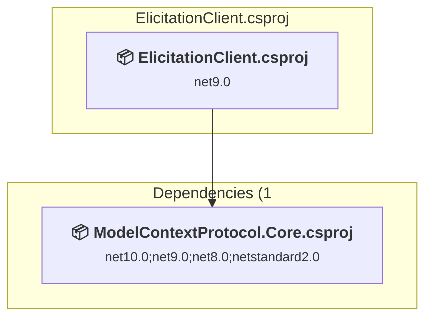
```mermaid
flowchart TB
    subgraph current["ElicitationClient.csproj"]
        MAIN["<b>📦&nbsp;ElicitationClient.csproj</b><br/><small>net9.0</small>"]
        click MAIN "#docsconceptselicitationsamplesclientelicitationclientcsproj"
    end
    subgraph downstream["Dependencies (1"]
        P21["<b>📦&nbsp;ModelContextProtocol.Core.csproj</b><br/><small>net10.0;net9.0;net8.0;netstandard2.0</small>"]
        click P21 "#srcmodelcontextprotocolcoremodelcontextprotocolcorecsproj"
    end
    MAIN --> P21

```

### API Compatibility

| Category | Count | Impact |
| :--- | :---: | :--- |
| 🔴 Binary Incompatible | 0 | High - Require code changes |
| 🟡 Source Incompatible | 0 | Medium - Needs re-compilation and potential conflicting API error fixing |
| 🔵 Behavioral change | 3 | Low - Behavioral changes that may require testing at runtime |
| ✅ Compatible | 140 |  |
| ***Total APIs Analyzed*** | ***143*** |  |

### docs\concepts\elicitation\samples\server\Elicitation.csproj

#### Project Info

- **Current Target Framework:** net9.0
- **Proposed Target Framework:** net10.0
- **SDK-style**: True
- **Project Kind:** AspNetCore
- **Dependencies**: 1
- **Dependants**: 0
- **Number of Files**: 2
- **Number of Files with Incidents**: 2
- **Lines of Code**: 301
- **Estimated LOC to modify**: 1+ (at least 0.3% of the project)

#### Dependency Graph

Legend:
📦 SDK-style project
⚙️ Classic project

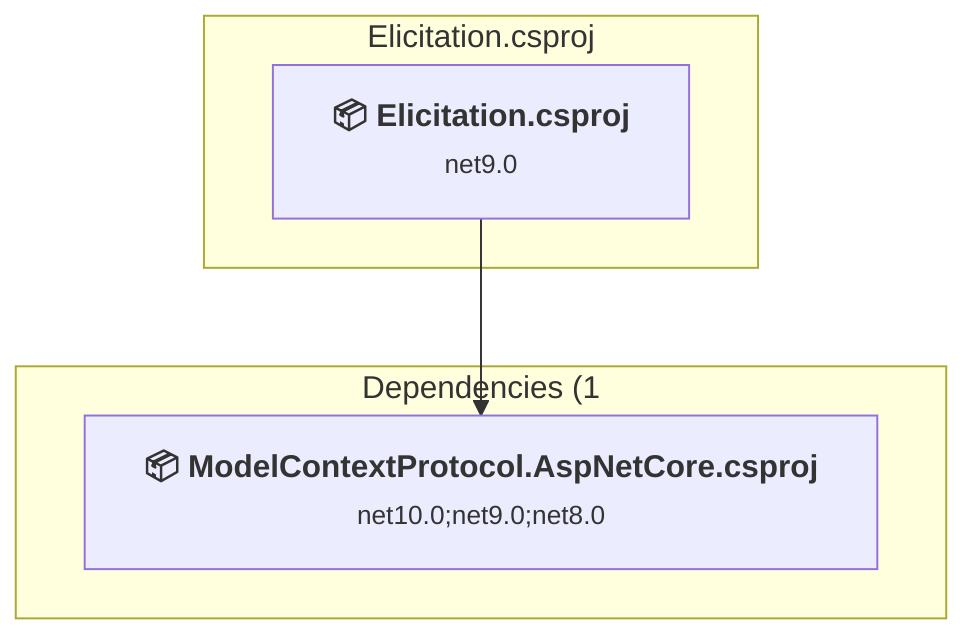
```mermaid
flowchart TB
    subgraph current["Elicitation.csproj"]
        MAIN["<b>📦&nbsp;Elicitation.csproj</b><br/><small>net9.0</small>"]
        click MAIN "#docsconceptselicitationsamplesserverelicitationcsproj"
    end
    subgraph downstream["Dependencies (1"]
        P20["<b>📦&nbsp;ModelContextProtocol.AspNetCore.csproj</b><br/><small>net10.0;net9.0;net8.0</small>"]
        click P20 "#srcmodelcontextprotocolaspnetcoremodelcontextprotocolaspnetcorecsproj"
    end
    MAIN --> P20

```

### API Compatibility

| Category | Count | Impact |
| :--- | :---: | :--- |
| 🔴 Binary Incompatible | 0 | High - Require code changes |
| 🟡 Source Incompatible | 0 | Medium - Needs re-compilation and potential conflicting API error fixing |
| 🔵 Behavioral change | 1 | Low - Behavioral changes that may require testing at runtime |
| ✅ Compatible | 352 |  |
| ***Total APIs Analyzed*** | ***353*** |  |

### docs\concepts\httpcontext\samples\HttpContext.csproj

#### Project Info

- **Current Target Framework:** net9.0
- **Proposed Target Framework:** net10.0
- **SDK-style**: True
- **Project Kind:** AspNetCore
- **Dependencies**: 1
- **Dependants**: 0
- **Number of Files**: 4
- **Number of Files with Incidents**: 2
- **Lines of Code**: 57
- **Estimated LOC to modify**: 1+ (at least 1.8% of the project)

#### Dependency Graph

Legend:
📦 SDK-style project
⚙️ Classic project

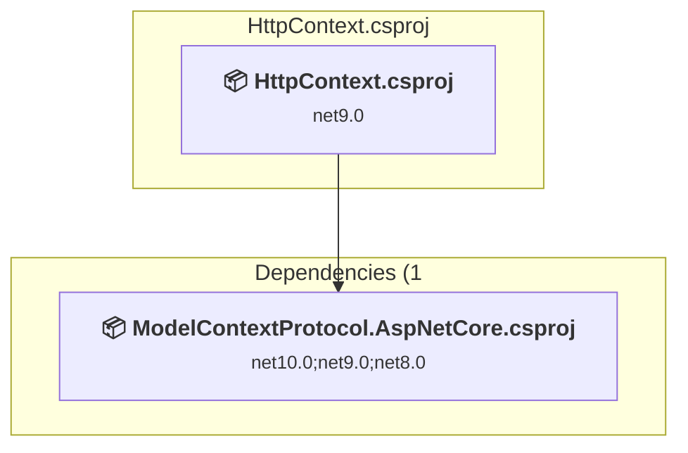
```mermaid
flowchart TB
    subgraph current["HttpContext.csproj"]
        MAIN["<b>📦&nbsp;HttpContext.csproj</b><br/><small>net9.0</small>"]
        click MAIN "#docsconceptshttpcontextsampleshttpcontextcsproj"
    end
    subgraph downstream["Dependencies (1"]
        P20["<b>📦&nbsp;ModelContextProtocol.AspNetCore.csproj</b><br/><small>net10.0;net9.0;net8.0</small>"]
        click P20 "#srcmodelcontextprotocolaspnetcoremodelcontextprotocolaspnetcorecsproj"
    end
    MAIN --> P20

```

### API Compatibility

| Category | Count | Impact |
| :--- | :---: | :--- |
| 🔴 Binary Incompatible | 0 | High - Require code changes |
| 🟡 Source Incompatible | 0 | Medium - Needs re-compilation and potential conflicting API error fixing |
| 🔵 Behavioral change | 1 | Low - Behavioral changes that may require testing at runtime |
| ✅ Compatible | 63 |  |
| ***Total APIs Analyzed*** | ***64*** |  |

### docs\concepts\logging\samples\client\LoggingClient.csproj

#### Project Info

- **Current Target Framework:** net9.0
- **Proposed Target Framework:** net10.0
- **SDK-style**: True
- **Project Kind:** DotNetCoreApp
- **Dependencies**: 1
- **Dependants**: 0
- **Number of Files**: 1
- **Number of Files with Incidents**: 2
- **Lines of Code**: 67
- **Estimated LOC to modify**: 3+ (at least 4.5% of the project)

#### Dependency Graph

Legend:
📦 SDK-style project
⚙️ Classic project

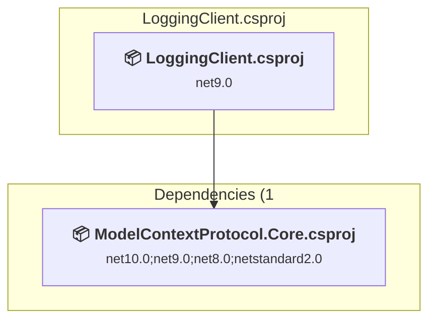
```mermaid
flowchart TB
    subgraph current["LoggingClient.csproj"]
        MAIN["<b>📦&nbsp;LoggingClient.csproj</b><br/><small>net9.0</small>"]
        click MAIN "#docsconceptsloggingsamplesclientloggingclientcsproj"
    end
    subgraph downstream["Dependencies (1"]
        P21["<b>📦&nbsp;ModelContextProtocol.Core.csproj</b><br/><small>net10.0;net9.0;net8.0;netstandard2.0</small>"]
        click P21 "#srcmodelcontextprotocolcoremodelcontextprotocolcorecsproj"
    end
    MAIN --> P21

```

### API Compatibility

| Category | Count | Impact |
| :--- | :---: | :--- |
| 🔴 Binary Incompatible | 0 | High - Require code changes |
| 🟡 Source Incompatible | 0 | Medium - Needs re-compilation and potential conflicting API error fixing |
| 🔵 Behavioral change | 3 | Low - Behavioral changes that may require testing at runtime |
| ✅ Compatible | 40 |  |
| ***Total APIs Analyzed*** | ***43*** |  |

### docs\concepts\logging\samples\server\Logging.csproj

#### Project Info

- **Current Target Framework:** net9.0
- **Proposed Target Framework:** net10.0
- **SDK-style**: True
- **Project Kind:** AspNetCore
- **Dependencies**: 1
- **Dependants**: 0
- **Number of Files**: 4
- **Number of Files with Incidents**: 1
- **Lines of Code**: 68
- **Estimated LOC to modify**: 0+ (at least 0.0% of the project)

#### Dependency Graph

Legend:
📦 SDK-style project
⚙️ Classic project

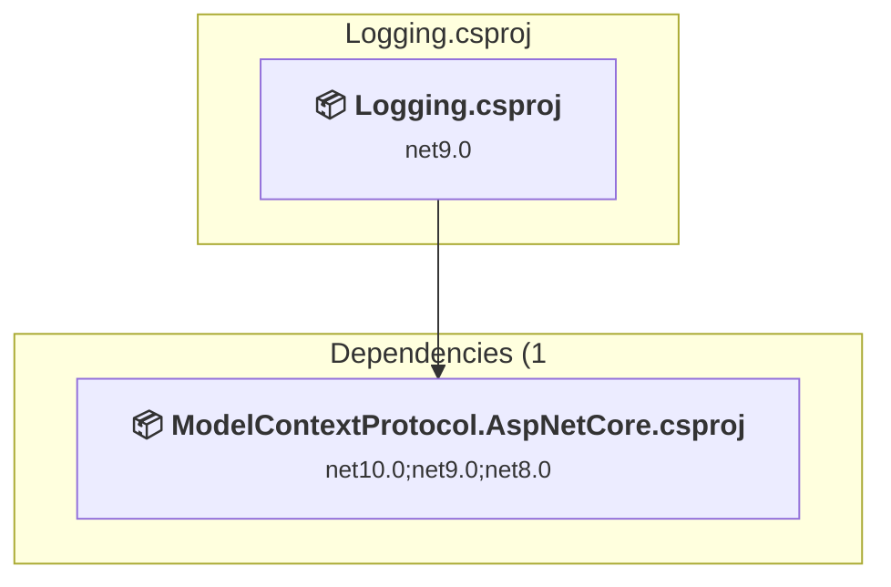
```mermaid
flowchart TB
    subgraph current["Logging.csproj"]
        MAIN["<b>📦&nbsp;Logging.csproj</b><br/><small>net9.0</small>"]
        click MAIN "#docsconceptsloggingsamplesserverloggingcsproj"
    end
    subgraph downstream["Dependencies (1"]
        P20["<b>📦&nbsp;ModelContextProtocol.AspNetCore.csproj</b><br/><small>net10.0;net9.0;net8.0</small>"]
        click P20 "#srcmodelcontextprotocolaspnetcoremodelcontextprotocolaspnetcorecsproj"
    end
    MAIN --> P20

```

### API Compatibility

| Category | Count | Impact |
| :--- | :---: | :--- |
| 🔴 Binary Incompatible | 0 | High - Require code changes |
| 🟡 Source Incompatible | 0 | Medium - Needs re-compilation and potential conflicting API error fixing |
| 🔵 Behavioral change | 0 | Low - Behavioral changes that may require testing at runtime |
| ✅ Compatible | 66 |  |
| ***Total APIs Analyzed*** | ***66*** |  |

### docs\concepts\progress\samples\client\ProgressClient.csproj

#### Project Info

- **Current Target Framework:** net9.0
- **Proposed Target Framework:** net10.0
- **SDK-style**: True
- **Project Kind:** DotNetCoreApp
- **Dependencies**: 1
- **Dependants**: 0
- **Number of Files**: 1
- **Number of Files with Incidents**: 2
- **Lines of Code**: 52
- **Estimated LOC to modify**: 3+ (at least 5.8% of the project)

#### Dependency Graph

Legend:
📦 SDK-style project
⚙️ Classic project

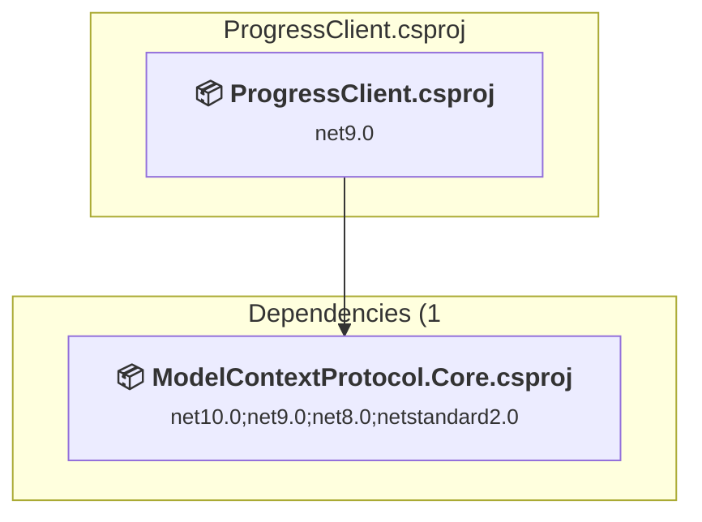
```mermaid
flowchart TB
    subgraph current["ProgressClient.csproj"]
        MAIN["<b>📦&nbsp;ProgressClient.csproj</b><br/><small>net9.0</small>"]
        click MAIN "#docsconceptsprogresssamplesclientprogressclientcsproj"
    end
    subgraph downstream["Dependencies (1"]
        P21["<b>📦&nbsp;ModelContextProtocol.Core.csproj</b><br/><small>net10.0;net9.0;net8.0;netstandard2.0</small>"]
        click P21 "#srcmodelcontextprotocolcoremodelcontextprotocolcorecsproj"
    end
    MAIN --> P21

```

### API Compatibility

| Category | Count | Impact |
| :--- | :---: | :--- |
| 🔴 Binary Incompatible | 0 | High - Require code changes |
| 🟡 Source Incompatible | 0 | Medium - Needs re-compilation and potential conflicting API error fixing |
| 🔵 Behavioral change | 3 | Low - Behavioral changes that may require testing at runtime |
| ✅ Compatible | 40 |  |
| ***Total APIs Analyzed*** | ***43*** |  |

### docs\concepts\progress\samples\server\Progress.csproj

#### Project Info

- **Current Target Framework:** net9.0
- **Proposed Target Framework:** net10.0
- **SDK-style**: True
- **Project Kind:** AspNetCore
- **Dependencies**: 1
- **Dependants**: 0
- **Number of Files**: 4
- **Number of Files with Incidents**: 2
- **Lines of Code**: 69
- **Estimated LOC to modify**: 1+ (at least 1.4% of the project)

#### Dependency Graph

Legend:
📦 SDK-style project
⚙️ Classic project

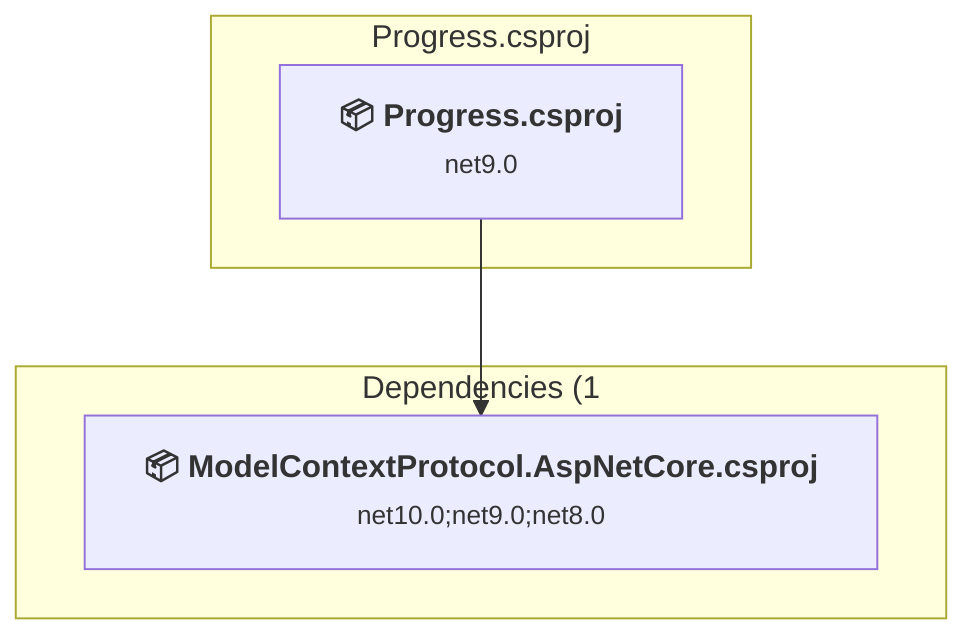
```mermaid
flowchart TB
    subgraph current["Progress.csproj"]
        MAIN["<b>📦&nbsp;Progress.csproj</b><br/><small>net9.0</small>"]
        click MAIN "#docsconceptsprogresssamplesserverprogresscsproj"
    end
    subgraph downstream["Dependencies (1"]
        P20["<b>📦&nbsp;ModelContextProtocol.AspNetCore.csproj</b><br/><small>net10.0;net9.0;net8.0</small>"]
        click P20 "#srcmodelcontextprotocolaspnetcoremodelcontextprotocolaspnetcorecsproj"
    end
    MAIN --> P20

```

### API Compatibility

| Category | Count | Impact |
| :--- | :---: | :--- |
| 🔴 Binary Incompatible | 0 | High - Require code changes |
| 🟡 Source Incompatible | 0 | Medium - Needs re-compilation and potential conflicting API error fixing |
| 🔵 Behavioral change | 1 | Low - Behavioral changes that may require testing at runtime |
| ✅ Compatible | 67 |  |
| ***Total APIs Analyzed*** | ***68*** |  |

### samples\AspNetCoreMcpPerSessionTools\AspNetCoreMcpPerSessionTools.csproj

#### Project Info

- **Current Target Framework:** net9.0
- **Proposed Target Framework:** net10.0
- **SDK-style**: True
- **Project Kind:** AspNetCore
- **Dependencies**: 1
- **Dependants**: 0
- **Number of Files**: 6
- **Number of Files with Incidents**: 1
- **Lines of Code**: 234
- **Estimated LOC to modify**: 0+ (at least 0.0% of the project)

#### Dependency Graph

Legend:
📦 SDK-style project
⚙️ Classic project

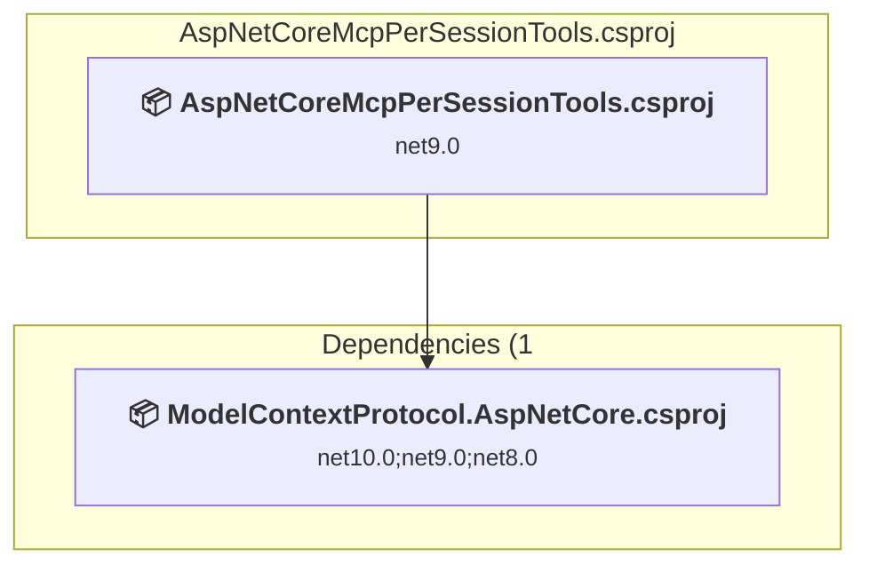
```mermaid
flowchart TB
    subgraph current["AspNetCoreMcpPerSessionTools.csproj"]
        MAIN["<b>📦&nbsp;AspNetCoreMcpPerSessionTools.csproj</b><br/><small>net9.0</small>"]
        click MAIN "#samplesaspnetcoremcppersessiontoolsaspnetcoremcppersessiontoolscsproj"
    end
    subgraph downstream["Dependencies (1"]
        P20["<b>📦&nbsp;ModelContextProtocol.AspNetCore.csproj</b><br/><small>net10.0;net9.0;net8.0</small>"]
        click P20 "#srcmodelcontextprotocolaspnetcoremodelcontextprotocolaspnetcorecsproj"
    end
    MAIN --> P20

```

### API Compatibility

| Category | Count | Impact |
| :--- | :---: | :--- |
| 🔴 Binary Incompatible | 0 | High - Require code changes |
| 🟡 Source Incompatible | 0 | Medium - Needs re-compilation and potential conflicting API error fixing |
| 🔵 Behavioral change | 0 | Low - Behavioral changes that may require testing at runtime |
| ✅ Compatible | 245 |  |
| ***Total APIs Analyzed*** | ***245*** |  |

### samples\AspNetCoreMcpServer\AspNetCoreMcpServer.csproj

#### Project Info

- **Current Target Framework:** net9.0
- **Proposed Target Framework:** net10.0
- **SDK-style**: True
- **Project Kind:** AspNetCore
- **Dependencies**: 1
- **Dependants**: 0
- **Number of Files**: 7
- **Number of Files with Incidents**: 3
- **Lines of Code**: 192
- **Estimated LOC to modify**: 9+ (at least 4.7% of the project)

#### Dependency Graph

Legend:
📦 SDK-style project
⚙️ Classic project

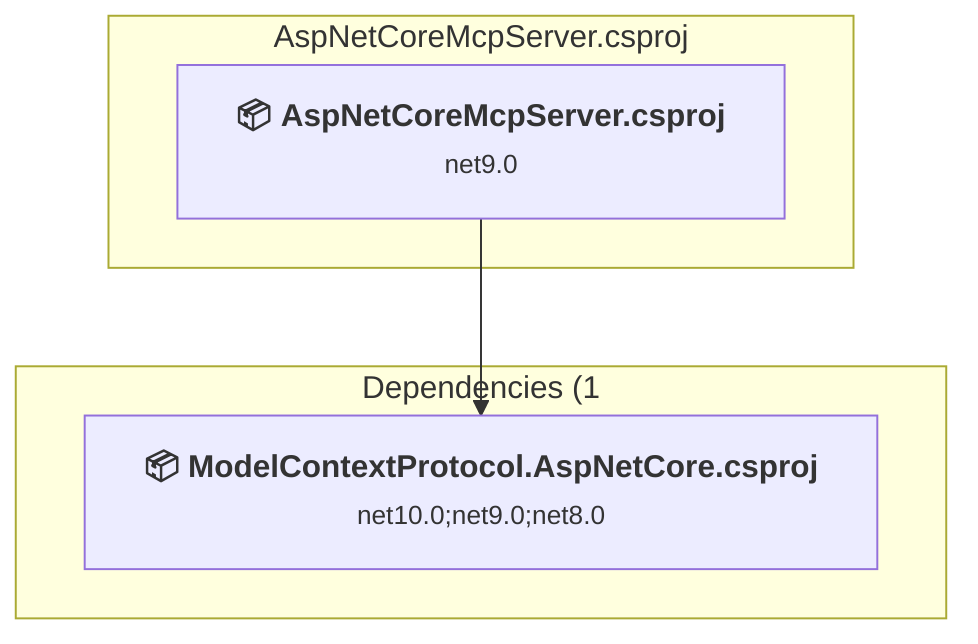
```mermaid
flowchart TB
    subgraph current["AspNetCoreMcpServer.csproj"]
        MAIN["<b>📦&nbsp;AspNetCoreMcpServer.csproj</b><br/><small>net9.0</small>"]
        click MAIN "#samplesaspnetcoremcpserveraspnetcoremcpservercsproj"
    end
    subgraph downstream["Dependencies (1"]
        P20["<b>📦&nbsp;ModelContextProtocol.AspNetCore.csproj</b><br/><small>net10.0;net9.0;net8.0</small>"]
        click P20 "#srcmodelcontextprotocolaspnetcoremodelcontextprotocolaspnetcorecsproj"
    end
    MAIN --> P20

```

### API Compatibility

| Category | Count | Impact |
| :--- | :---: | :--- |
| 🔴 Binary Incompatible | 1 | High - Require code changes |
| 🟡 Source Incompatible | 0 | Medium - Needs re-compilation and potential conflicting API error fixing |
| 🔵 Behavioral change | 8 | Low - Behavioral changes that may require testing at runtime |
| ✅ Compatible | 397 |  |
| ***Total APIs Analyzed*** | ***406*** |  |

### samples\ChatWithTools\ChatWithTools.csproj

#### Project Info

- **Current Target Framework:** net8.0
- **Proposed Target Framework:** net10.0
- **SDK-style**: True
- **Project Kind:** DotNetCoreApp
- **Dependencies**: 1
- **Dependants**: 0
- **Number of Files**: 1
- **Number of Files with Incidents**: 1
- **Lines of Code**: 87
- **Estimated LOC to modify**: 0+ (at least 0.0% of the project)

#### Dependency Graph

Legend:
📦 SDK-style project
⚙️ Classic project

```mermaid
flowchart TB
    subgraph current["ChatWithTools.csproj"]
        MAIN["<b>📦&nbsp;ChatWithTools.csproj</b><br/><small>net8.0</small>"]
        click MAIN "#sampleschatwithtoolschatwithtoolscsproj"
    end
    subgraph downstream["Dependencies (1"]
        P21["<b>📦&nbsp;ModelContextProtocol.Core.csproj</b><br/><small>net10.0;net9.0;net8.0;netstandard2.0</small>"]
        click P21 "#srcmodelcontextprotocolcoremodelcontextprotocolcorecsproj"
    end
    MAIN --> P21

```

### API Compatibility

| Category | Count | Impact |
| :--- | :---: | :--- |
| 🔴 Binary Incompatible | 0 | High - Require code changes |
| 🟡 Source Incompatible | 0 | Medium - Needs re-compilation and potential conflicting API error fixing |
| 🔵 Behavioral change | 0 | Low - Behavioral changes that may require testing at runtime |
| ✅ Compatible | 126 |  |
| ***Total APIs Analyzed*** | ***126*** |  |

### samples\EverythingServer\EverythingServer.csproj

#### Project Info

- **Current Target Framework:** net9.0
- **Proposed Target Framework:** net10.0
- **SDK-style**: True
- **Project Kind:** AspNetCore
- **Dependencies**: 1
- **Dependants**: 0
- **Number of Files**: 16
- **Number of Files with Incidents**: 1
- **Lines of Code**: 609
- **Estimated LOC to modify**: 0+ (at least 0.0% of the project)

#### Dependency Graph

Legend:
📦 SDK-style project
⚙️ Classic project

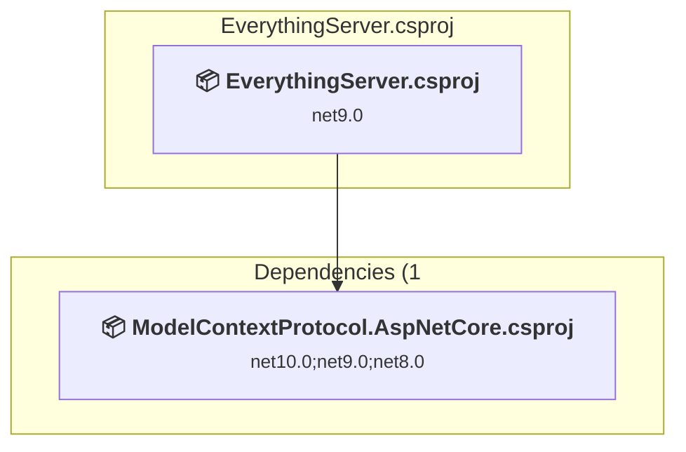
```mermaid
flowchart TB
    subgraph current["EverythingServer.csproj"]
        MAIN["<b>📦&nbsp;EverythingServer.csproj</b><br/><small>net9.0</small>"]
        click MAIN "#sampleseverythingservereverythingservercsproj"
    end
    subgraph downstream["Dependencies (1"]
        P20["<b>📦&nbsp;ModelContextProtocol.AspNetCore.csproj</b><br/><small>net10.0;net9.0;net8.0</small>"]
        click P20 "#srcmodelcontextprotocolaspnetcoremodelcontextprotocolaspnetcorecsproj"
    end
    MAIN --> P20

```

### API Compatibility

| Category | Count | Impact |
| :--- | :---: | :--- |
| 🔴 Binary Incompatible | 0 | High - Require code changes |
| 🟡 Source Incompatible | 0 | Medium - Needs re-compilation and potential conflicting API error fixing |
| 🔵 Behavioral change | 0 | Low - Behavioral changes that may require testing at runtime |
| ✅ Compatible | 724 |  |
| ***Total APIs Analyzed*** | ***724*** |  |

### samples\InMemoryTransport\InMemoryTransport.csproj

#### Project Info

- **Current Target Framework:** net8.0
- **Proposed Target Framework:** net10.0
- **SDK-style**: True
- **Project Kind:** DotNetCoreApp
- **Dependencies**: 1
- **Dependants**: 0
- **Number of Files**: 1
- **Number of Files with Incidents**: 1
- **Lines of Code**: 34
- **Estimated LOC to modify**: 0+ (at least 0.0% of the project)

#### Dependency Graph

Legend:
📦 SDK-style project
⚙️ Classic project

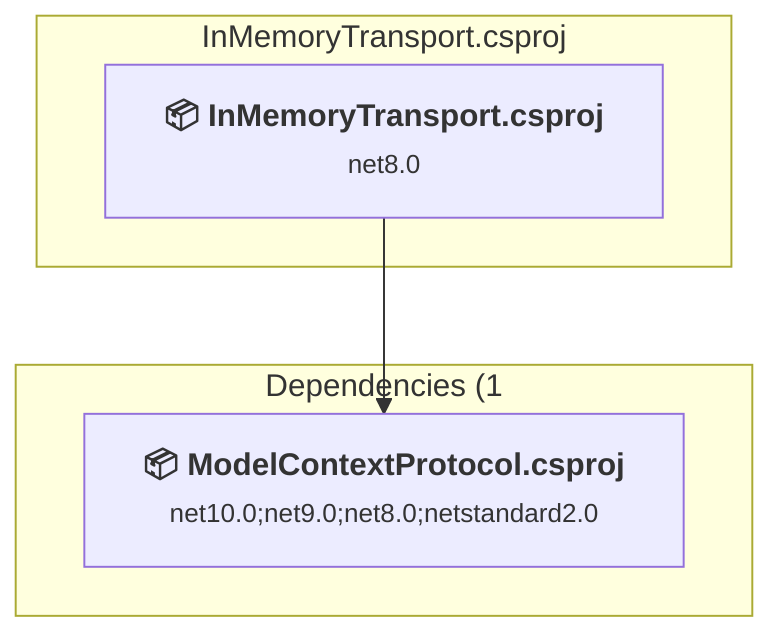
```mermaid
flowchart TB
    subgraph current["InMemoryTransport.csproj"]
        MAIN["<b>📦&nbsp;InMemoryTransport.csproj</b><br/><small>net8.0</small>"]
        click MAIN "#samplesinmemorytransportinmemorytransportcsproj"
    end
    subgraph downstream["Dependencies (1"]
        P22["<b>📦&nbsp;ModelContextProtocol.csproj</b><br/><small>net10.0;net9.0;net8.0;netstandard2.0</small>"]
        click P22 "#srcmodelcontextprotocolmodelcontextprotocolcsproj"
    end
    MAIN --> P22

```

### API Compatibility

| Category | Count | Impact |
| :--- | :---: | :--- |
| 🔴 Binary Incompatible | 0 | High - Require code changes |
| 🟡 Source Incompatible | 0 | Medium - Needs re-compilation and potential conflicting API error fixing |
| 🔵 Behavioral change | 0 | Low - Behavioral changes that may require testing at runtime |
| ✅ Compatible | 68 |  |
| ***Total APIs Analyzed*** | ***68*** |  |

### samples\LongRunningTasks\LongRunningTasks.csproj

#### Project Info

- **Current Target Framework:** net9.0
- **Proposed Target Framework:** net10.0
- **SDK-style**: True
- **Project Kind:** AspNetCore
- **Dependencies**: 1
- **Dependants**: 0
- **Number of Files**: 4
- **Number of Files with Incidents**: 3
- **Lines of Code**: 458
- **Estimated LOC to modify**: 3+ (at least 0.7% of the project)

#### Dependency Graph

Legend:
📦 SDK-style project
⚙️ Classic project

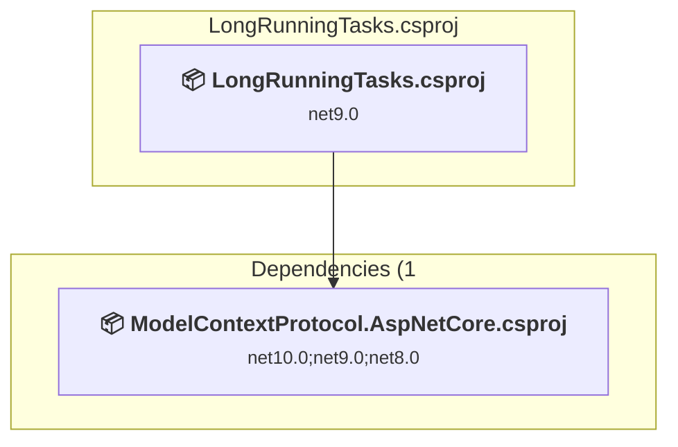
```mermaid
flowchart TB
    subgraph current["LongRunningTasks.csproj"]
        MAIN["<b>📦&nbsp;LongRunningTasks.csproj</b><br/><small>net9.0</small>"]
        click MAIN "#sampleslongrunningtaskslongrunningtaskscsproj"
    end
    subgraph downstream["Dependencies (1"]
        P20["<b>📦&nbsp;ModelContextProtocol.AspNetCore.csproj</b><br/><small>net10.0;net9.0;net8.0</small>"]
        click P20 "#srcmodelcontextprotocolaspnetcoremodelcontextprotocolaspnetcorecsproj"
    end
    MAIN --> P20

```

### API Compatibility

| Category | Count | Impact |
| :--- | :---: | :--- |
| 🔴 Binary Incompatible | 0 | High - Require code changes |
| 🟡 Source Incompatible | 3 | Medium - Needs re-compilation and potential conflicting API error fixing |
| 🔵 Behavioral change | 0 | Low - Behavioral changes that may require testing at runtime |
| ✅ Compatible | 378 |  |
| ***Total APIs Analyzed*** | ***381*** |  |

### samples\ProtectedMcpClient\ProtectedMcpClient.csproj

#### Project Info

- **Current Target Framework:** net9.0
- **Proposed Target Framework:** net10.0
- **SDK-style**: True
- **Project Kind:** DotNetCoreApp
- **Dependencies**: 1
- **Dependants**: 0
- **Number of Files**: 1
- **Number of Files with Incidents**: 2
- **Lines of Code**: 158
- **Estimated LOC to modify**: 12+ (at least 7.6% of the project)

#### Dependency Graph

Legend:
📦 SDK-style project
⚙️ Classic project

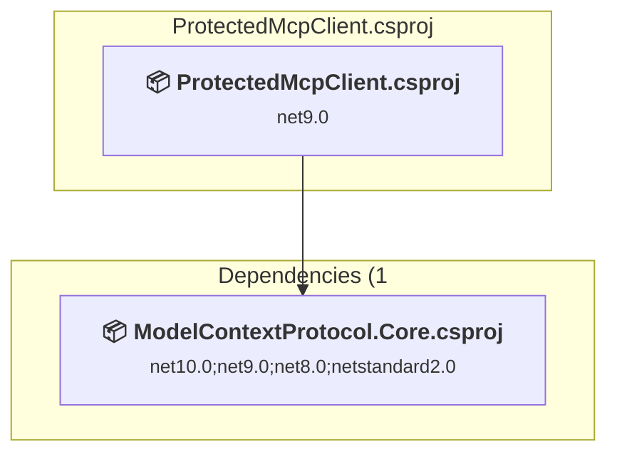
```mermaid
flowchart TB
    subgraph current["ProtectedMcpClient.csproj"]
        MAIN["<b>📦&nbsp;ProtectedMcpClient.csproj</b><br/><small>net9.0</small>"]
        click MAIN "#samplesprotectedmcpclientprotectedmcpclientcsproj"
    end
    subgraph downstream["Dependencies (1"]
        P21["<b>📦&nbsp;ModelContextProtocol.Core.csproj</b><br/><small>net10.0;net9.0;net8.0;netstandard2.0</small>"]
        click P21 "#srcmodelcontextprotocolcoremodelcontextprotocolcorecsproj"
    end
    MAIN --> P21

```

### API Compatibility

| Category | Count | Impact |
| :--- | :---: | :--- |
| 🔴 Binary Incompatible | 0 | High - Require code changes |
| 🟡 Source Incompatible | 2 | Medium - Needs re-compilation and potential conflicting API error fixing |
| 🔵 Behavioral change | 10 | Low - Behavioral changes that may require testing at runtime |
| ✅ Compatible | 187 |  |
| ***Total APIs Analyzed*** | ***199*** |  |

### samples\ProtectedMcpServer\ProtectedMcpServer.csproj

#### Project Info

- **Current Target Framework:** net9.0
- **Proposed Target Framework:** net10.0
- **SDK-style**: True
- **Project Kind:** AspNetCore
- **Dependencies**: 1
- **Dependants**: 0
- **Number of Files**: 3
- **Number of Files with Incidents**: 3
- **Lines of Code**: 190
- **Estimated LOC to modify**: 20+ (at least 10.5% of the project)

#### Dependency Graph

Legend:
📦 SDK-style project
⚙️ Classic project

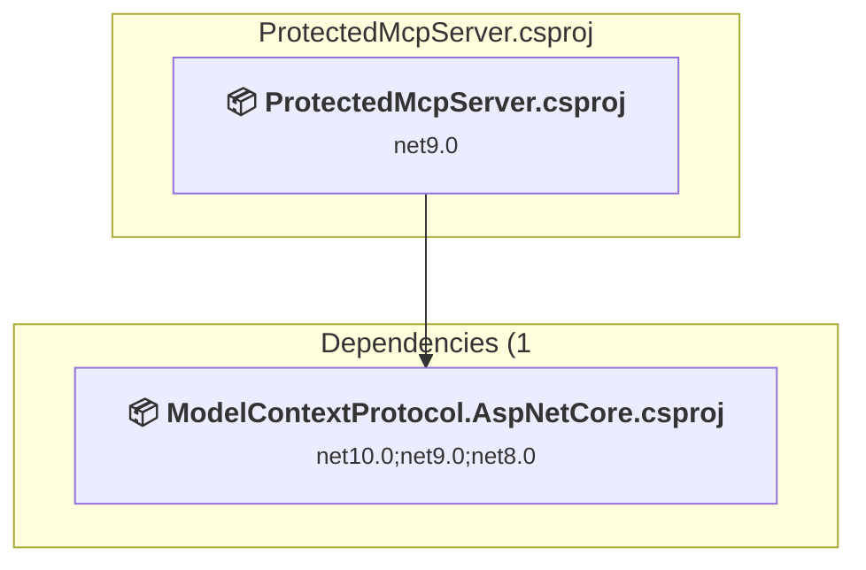
```mermaid
flowchart TB
    subgraph current["ProtectedMcpServer.csproj"]
        MAIN["<b>📦&nbsp;ProtectedMcpServer.csproj</b><br/><small>net9.0</small>"]
        click MAIN "#samplesprotectedmcpserverprotectedmcpservercsproj"
    end
    subgraph downstream["Dependencies (1"]
        P20["<b>📦&nbsp;ModelContextProtocol.AspNetCore.csproj</b><br/><small>net10.0;net9.0;net8.0</small>"]
        click P20 "#srcmodelcontextprotocolaspnetcoremodelcontextprotocolaspnetcorecsproj"
    end
    MAIN --> P20

```

### API Compatibility

| Category | Count | Impact |
| :--- | :---: | :--- |
| 🔴 Binary Incompatible | 1 | High - Require code changes |
| 🟡 Source Incompatible | 14 | Medium - Needs re-compilation and potential conflicting API error fixing |
| 🔵 Behavioral change | 5 | Low - Behavioral changes that may require testing at runtime |
| ✅ Compatible | 326 |  |
| ***Total APIs Analyzed*** | ***346*** |  |

### samples\QuickstartClient\QuickstartClient.csproj

#### Project Info

- **Current Target Framework:** net8.0
- **Proposed Target Framework:** net10.0
- **SDK-style**: True
- **Project Kind:** DotNetCoreApp
- **Dependencies**: 1
- **Dependants**: 0
- **Number of Files**: 1
- **Number of Files with Incidents**: 2
- **Lines of Code**: 144
- **Estimated LOC to modify**: 3+ (at least 2.1% of the project)

#### Dependency Graph

Legend:
📦 SDK-style project
⚙️ Classic project

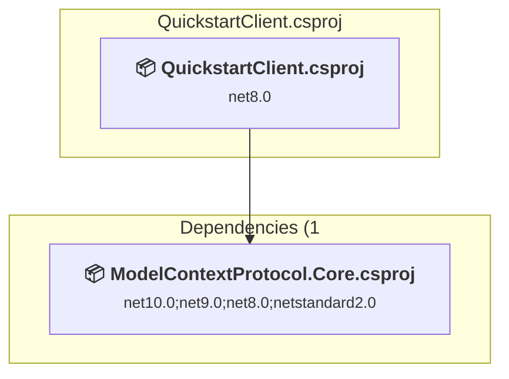
```mermaid
flowchart TB
    subgraph current["QuickstartClient.csproj"]
        MAIN["<b>📦&nbsp;QuickstartClient.csproj</b><br/><small>net8.0</small>"]
        click MAIN "#samplesquickstartclientquickstartclientcsproj"
    end
    subgraph downstream["Dependencies (1"]
        P21["<b>📦&nbsp;ModelContextProtocol.Core.csproj</b><br/><small>net10.0;net9.0;net8.0;netstandard2.0</small>"]
        click P21 "#srcmodelcontextprotocolcoremodelcontextprotocolcorecsproj"
    end
    MAIN --> P21

```

### API Compatibility

| Category | Count | Impact |
| :--- | :---: | :--- |
| 🔴 Binary Incompatible | 0 | High - Require code changes |
| 🟡 Source Incompatible | 0 | Medium - Needs re-compilation and potential conflicting API error fixing |
| 🔵 Behavioral change | 3 | Low - Behavioral changes that may require testing at runtime |
| ✅ Compatible | 169 |  |
| ***Total APIs Analyzed*** | ***172*** |  |

### samples\QuickstartWeatherServer\QuickstartWeatherServer.csproj

#### Project Info

- **Current Target Framework:** net8.0
- **Proposed Target Framework:** net10.0
- **SDK-style**: True
- **Project Kind:** DotNetCoreApp
- **Dependencies**: 1
- **Dependants**: 0
- **Number of Files**: 3
- **Number of Files with Incidents**: 4
- **Lines of Code**: 95
- **Estimated LOC to modify**: 8+ (at least 8.4% of the project)

#### Dependency Graph

Legend:
📦 SDK-style project
⚙️ Classic project

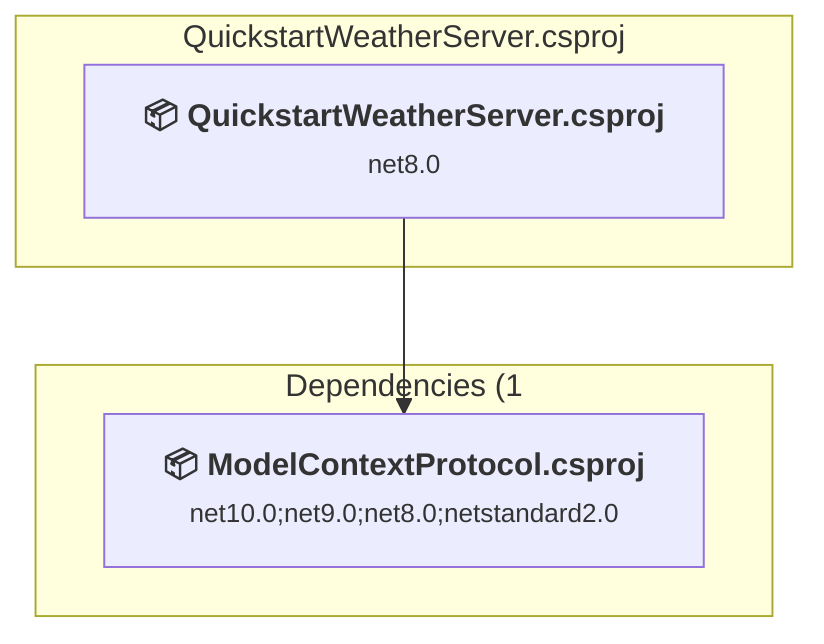
```mermaid
flowchart TB
    subgraph current["QuickstartWeatherServer.csproj"]
        MAIN["<b>📦&nbsp;QuickstartWeatherServer.csproj</b><br/><small>net8.0</small>"]
        click MAIN "#samplesquickstartweatherserverquickstartweatherservercsproj"
    end
    subgraph downstream["Dependencies (1"]
        P22["<b>📦&nbsp;ModelContextProtocol.csproj</b><br/><small>net10.0;net9.0;net8.0;netstandard2.0</small>"]
        click P22 "#srcmodelcontextprotocolmodelcontextprotocolcsproj"
    end
    MAIN --> P22

```

### API Compatibility

| Category | Count | Impact |
| :--- | :---: | :--- |
| 🔴 Binary Incompatible | 0 | High - Require code changes |
| 🟡 Source Incompatible | 0 | Medium - Needs re-compilation and potential conflicting API error fixing |
| 🔵 Behavioral change | 8 | Low - Behavioral changes that may require testing at runtime |
| ✅ Compatible | 171 |  |
| ***Total APIs Analyzed*** | ***179*** |  |

### samples\TestServerWithHosting\TestServerWithHosting.csproj

#### Project Info

- **Current Target Framework:** net10.0;net9.0;net8.0;net472
- **Proposed Target Framework:** net10.0;net9.0;net8.0;net472;net10.0
- **SDK-style**: True
- **Project Kind:** DotNetCoreApp
- **Dependencies**: 1
- **Dependants**: 2
- **Number of Files**: 3
- **Number of Files with Incidents**: 1
- **Lines of Code**: 94
- **Estimated LOC to modify**: 0+ (at least 0.0% of the project)

#### Dependency Graph

Legend:
📦 SDK-style project
⚙️ Classic project

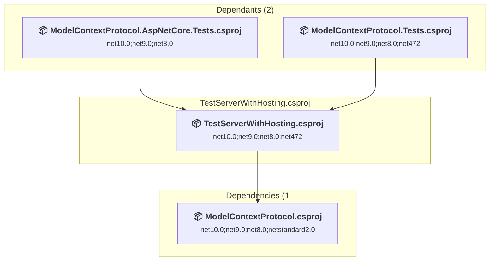
```mermaid
flowchart TB
    subgraph upstream["Dependants (2)"]
        P25["<b>📦&nbsp;ModelContextProtocol.AspNetCore.Tests.csproj</b><br/><small>net10.0;net9.0;net8.0</small>"]
        P30["<b>📦&nbsp;ModelContextProtocol.Tests.csproj</b><br/><small>net10.0;net9.0;net8.0;net472</small>"]
        click P25 "#testsmodelcontextprotocolaspnetcoretestsmodelcontextprotocolaspnetcoretestscsproj"
        click P30 "#testsmodelcontextprotocoltestsmodelcontextprotocoltestscsproj"
    end
    subgraph current["TestServerWithHosting.csproj"]
        MAIN["<b>📦&nbsp;TestServerWithHosting.csproj</b><br/><small>net10.0;net9.0;net8.0;net472</small>"]
        click MAIN "#samplestestserverwithhostingtestserverwithhostingcsproj"
    end
    subgraph downstream["Dependencies (1"]
        P22["<b>📦&nbsp;ModelContextProtocol.csproj</b><br/><small>net10.0;net9.0;net8.0;netstandard2.0</small>"]
        click P22 "#srcmodelcontextprotocolmodelcontextprotocolcsproj"
    end
    P25 --> MAIN
    P30 --> MAIN
    MAIN --> P22

```

### API Compatibility

| Category | Count | Impact |
| :--- | :---: | :--- |
| 🔴 Binary Incompatible | 0 | High - Require code changes |
| 🟡 Source Incompatible | 0 | Medium - Needs re-compilation and potential conflicting API error fixing |
| 🔵 Behavioral change | 0 | Low - Behavioral changes that may require testing at runtime |
| ✅ Compatible | 136 |  |
| ***Total APIs Analyzed*** | ***136*** |  |

### src\ModelContextProtocol.Analyzers\ModelContextProtocol.Analyzers.csproj

#### Project Info

- **Current Target Framework:** netstandard2.0✅
- **SDK-style**: True
- **Project Kind:** ClassLibrary
- **Dependencies**: 0
- **Dependants**: 2
- **Number of Files**: 6
- **Lines of Code**: 818
- **Estimated LOC to modify**: 0+ (at least 0.0% of the project)

#### Dependency Graph

Legend:
📦 SDK-style project
⚙️ Classic project

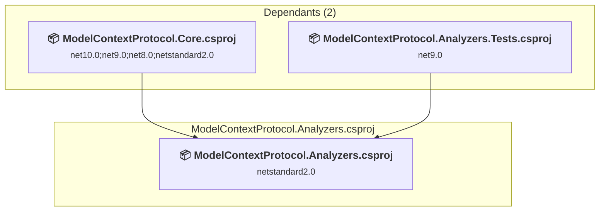
```mermaid
flowchart TB
    subgraph upstream["Dependants (2)"]
        P21["<b>📦&nbsp;ModelContextProtocol.Core.csproj</b><br/><small>net10.0;net9.0;net8.0;netstandard2.0</small>"]
        P23["<b>📦&nbsp;ModelContextProtocol.Analyzers.Tests.csproj</b><br/><small>net9.0</small>"]
        click P21 "#srcmodelcontextprotocolcoremodelcontextprotocolcorecsproj"
        click P23 "#testsmodelcontextprotocolanalyzerstestsmodelcontextprotocolanalyzerstestscsproj"
    end
    subgraph current["ModelContextProtocol.Analyzers.csproj"]
        MAIN["<b>📦&nbsp;ModelContextProtocol.Analyzers.csproj</b><br/><small>netstandard2.0</small>"]
        click MAIN "#srcmodelcontextprotocolanalyzersmodelcontextprotocolanalyzerscsproj"
    end
    P21 --> MAIN
    P23 --> MAIN

```

### API Compatibility

| Category | Count | Impact |
| :--- | :---: | :--- |
| 🔴 Binary Incompatible | 0 | High - Require code changes |
| 🟡 Source Incompatible | 0 | Medium - Needs re-compilation and potential conflicting API error fixing |
| 🔵 Behavioral change | 0 | Low - Behavioral changes that may require testing at runtime |
| ✅ Compatible | 690 |  |
| ***Total APIs Analyzed*** | ***690*** |  |

### src\ModelContextProtocol.AspNetCore\ModelContextProtocol.AspNetCore.csproj

#### Project Info

- **Current Target Framework:** net10.0;net9.0;net8.0
- **Proposed Target Framework:** net10.0;net9.0;net8.0;net10.0
- **SDK-style**: True
- **Project Kind:** ClassLibrary
- **Dependencies**: 1
- **Dependants**: 13
- **Number of Files**: 49
- **Number of Files with Incidents**: 4
- **Lines of Code**: 4466
- **Estimated LOC to modify**: 10+ (at least 0.2% of the project)

#### Dependency Graph

Legend:
📦 SDK-style project
⚙️ Classic project

```mermaid
flowchart TB
    subgraph upstream["Dependants (13)"]
        P2["<b>📦&nbsp;Elicitation.csproj</b><br/><small>net9.0</small>"]
        P3["<b>📦&nbsp;HttpContext.csproj</b><br/><small>net9.0</small>"]
        P5["<b>📦&nbsp;Logging.csproj</b><br/><small>net9.0</small>"]
        P7["<b>📦&nbsp;Progress.csproj</b><br/><small>net9.0</small>"]
        P8["<b>📦&nbsp;AspNetCoreMcpPerSessionTools.csproj</b><br/><small>net9.0</small>"]
        P9["<b>📦&nbsp;AspNetCoreMcpServer.csproj</b><br/><small>net9.0</small>"]
        P11["<b>📦&nbsp;EverythingServer.csproj</b><br/><small>net9.0</small>"]
        P13["<b>📦&nbsp;LongRunningTasks.csproj</b><br/><small>net9.0</small>"]
        P15["<b>📦&nbsp;ProtectedMcpServer.csproj</b><br/><small>net9.0</small>"]
        P24["<b>📦&nbsp;ModelContextProtocol.AotCompatibility.TestApp.csproj</b><br/><small>net10.0</small>"]
        P25["<b>📦&nbsp;ModelContextProtocol.AspNetCore.Tests.csproj</b><br/><small>net10.0;net9.0;net8.0</small>"]
        P27["<b>📦&nbsp;ModelContextProtocol.ConformanceServer.csproj</b><br/><small>net10.0;net9.0;net8.0</small>"]
        P32["<b>📦&nbsp;ModelContextProtocol.TestSseServer.csproj</b><br/><small>net10.0;net9.0;net8.0</small>"]
        click P2 "#docsconceptselicitationsamplesserverelicitationcsproj"
        click P3 "#docsconceptshttpcontextsampleshttpcontextcsproj"
        click P5 "#docsconceptsloggingsamplesserverloggingcsproj"
        click P7 "#docsconceptsprogresssamplesserverprogresscsproj"
        click P8 "#samplesaspnetcoremcppersessiontoolsaspnetcoremcppersessiontoolscsproj"
        click P9 "#samplesaspnetcoremcpserveraspnetcoremcpservercsproj"
        click P11 "#sampleseverythingservereverythingservercsproj"
        click P13 "#sampleslongrunningtaskslongrunningtaskscsproj"
        click P15 "#samplesprotectedmcpserverprotectedmcpservercsproj"
        click P24 "#testsmodelcontextprotocolaotcompatibilitytestappmodelcontextprotocolaotcompatibilitytestappcsproj"
        click P25 "#testsmodelcontextprotocolaspnetcoretestsmodelcontextprotocolaspnetcoretestscsproj"
        click P27 "#testsmodelcontextprotocolconformanceservermodelcontextprotocolconformanceservercsproj"
        click P32 "#testsmodelcontextprotocoltestsseservermodelcontextprotocoltestsseservercsproj"
    end
    subgraph current["ModelContextProtocol.AspNetCore.csproj"]
        MAIN["<b>📦&nbsp;ModelContextProtocol.AspNetCore.csproj</b><br/><small>net10.0;net9.0;net8.0</small>"]
        click MAIN "#srcmodelcontextprotocolaspnetcoremodelcontextprotocolaspnetcorecsproj"
    end
    subgraph downstream["Dependencies (1"]
        P22["<b>📦&nbsp;ModelContextProtocol.csproj</b><br/><small>net10.0;net9.0;net8.0;netstandard2.0</small>"]
        click P22 "#srcmodelcontextprotocolmodelcontextprotocolcsproj"
    end
    P2 --> MAIN
    P3 --> MAIN
    P5 --> MAIN
    P7 --> MAIN
    P8 --> MAIN
    P9 --> MAIN
    P11 --> MAIN
    P13 --> MAIN
    P15 --> MAIN
    P24 --> MAIN
    P25 --> MAIN
    P27 --> MAIN
    P32 --> MAIN
    MAIN --> P22

```

### API Compatibility

| Category | Count | Impact |
| :--- | :---: | :--- |
| 🔴 Binary Incompatible | 0 | High - Require code changes |
| 🟡 Source Incompatible | 1 | Medium - Needs re-compilation and potential conflicting API error fixing |
| 🔵 Behavioral change | 9 | Low - Behavioral changes that may require testing at runtime |
| ✅ Compatible | 2298 |  |
| ***Total APIs Analyzed*** | ***2308*** |  |

### src\ModelContextProtocol.Core\ModelContextProtocol.Core.csproj

#### Project Info

- **Current Target Framework:** net10.0;net9.0;net8.0;netstandard2.0
- **Proposed Target Framework:** net10.0;net9.0;net8.0;netstandard2.0;net10.0
- **SDK-style**: True
- **Project Kind:** ClassLibrary
- **Dependencies**: 1
- **Dependants**: 15
- **Number of Files**: 265
- **Number of Files with Incidents**: 27
- **Lines of Code**: 31465
- **Estimated LOC to modify**: 233+ (at least 0.7% of the project)

#### Dependency Graph

Legend:
📦 SDK-style project
⚙️ Classic project

```mermaid
flowchart TB
    subgraph upstream["Dependants (15)"]
        P1["<b>📦&nbsp;ElicitationClient.csproj</b><br/><small>net9.0</small>"]
        P4["<b>📦&nbsp;LoggingClient.csproj</b><br/><small>net9.0</small>"]
        P6["<b>📦&nbsp;ProgressClient.csproj</b><br/><small>net9.0</small>"]
        P10["<b>📦&nbsp;ChatWithTools.csproj</b><br/><small>net8.0</small>"]
        P14["<b>📦&nbsp;ProtectedMcpClient.csproj</b><br/><small>net9.0</small>"]
        P16["<b>📦&nbsp;QuickstartClient.csproj</b><br/><small>net8.0</small>"]
        P22["<b>📦&nbsp;ModelContextProtocol.csproj</b><br/><small>net10.0;net9.0;net8.0;netstandard2.0</small>"]
        P23["<b>📦&nbsp;ModelContextProtocol.Analyzers.Tests.csproj</b><br/><small>net9.0</small>"]
        P24["<b>📦&nbsp;ModelContextProtocol.AotCompatibility.TestApp.csproj</b><br/><small>net10.0</small>"]
        P25["<b>📦&nbsp;ModelContextProtocol.AspNetCore.Tests.csproj</b><br/><small>net10.0;net9.0;net8.0</small>"]
        P26["<b>📦&nbsp;ModelContextProtocol.ConformanceClient.csproj</b><br/><small>net10.0;net9.0;net8.0</small>"]
        P28["<b>📦&nbsp;ModelContextProtocol.ExperimentalApiRegressionTest.csproj</b><br/><small>net10.0;net9.0;net8.0</small>"]
        P30["<b>📦&nbsp;ModelContextProtocol.Tests.csproj</b><br/><small>net10.0;net9.0;net8.0;net472</small>"]
        P31["<b>📦&nbsp;ModelContextProtocol.TestServer.csproj</b><br/><small>net10.0;net9.0;net8.0;net472</small>"]
        P32["<b>📦&nbsp;ModelContextProtocol.TestSseServer.csproj</b><br/><small>net10.0;net9.0;net8.0</small>"]
        click P1 "#docsconceptselicitationsamplesclientelicitationclientcsproj"
        click P4 "#docsconceptsloggingsamplesclientloggingclientcsproj"
        click P6 "#docsconceptsprogresssamplesclientprogressclientcsproj"
        click P10 "#sampleschatwithtoolschatwithtoolscsproj"
        click P14 "#samplesprotectedmcpclientprotectedmcpclientcsproj"
        click P16 "#samplesquickstartclientquickstartclientcsproj"
        click P22 "#srcmodelcontextprotocolmodelcontextprotocolcsproj"
        click P23 "#testsmodelcontextprotocolanalyzerstestsmodelcontextprotocolanalyzerstestscsproj"
        click P24 "#testsmodelcontextprotocolaotcompatibilitytestappmodelcontextprotocolaotcompatibilitytestappcsproj"
        click P25 "#testsmodelcontextprotocolaspnetcoretestsmodelcontextprotocolaspnetcoretestscsproj"
        click P26 "#testsmodelcontextprotocolconformanceclientmodelcontextprotocolconformanceclientcsproj"
        click P28 "#testsmodelcontextprotocolexperimentalapiregressiontestmodelcontextprotocolexperimentalapiregressiontestcsproj"
        click P30 "#testsmodelcontextprotocoltestsmodelcontextprotocoltestscsproj"
        click P31 "#testsmodelcontextprotocoltestservermodelcontextprotocoltestservercsproj"
        click P32 "#testsmodelcontextprotocoltestsseservermodelcontextprotocoltestsseservercsproj"
    end
    subgraph current["ModelContextProtocol.Core.csproj"]
        MAIN["<b>📦&nbsp;ModelContextProtocol.Core.csproj</b><br/><small>net10.0;net9.0;net8.0;netstandard2.0</small>"]
        click MAIN "#srcmodelcontextprotocolcoremodelcontextprotocolcorecsproj"
    end
    subgraph downstream["Dependencies (1"]
        P19["<b>📦&nbsp;ModelContextProtocol.Analyzers.csproj</b><br/><small>netstandard2.0</small>"]
        click P19 "#srcmodelcontextprotocolanalyzersmodelcontextprotocolanalyzerscsproj"
    end
    P1 --> MAIN
    P4 --> MAIN
    P6 --> MAIN
    P10 --> MAIN
    P14 --> MAIN
    P16 --> MAIN
    P22 --> MAIN
    P23 --> MAIN
    P24 --> MAIN
    P25 --> MAIN
    P26 --> MAIN
    P28 --> MAIN
    P30 --> MAIN
    P31 --> MAIN
    P32 --> MAIN
    MAIN --> P19

```

### API Compatibility

| Category | Count | Impact |
| :--- | :---: | :--- |
| 🔴 Binary Incompatible | 0 | High - Require code changes |
| 🟡 Source Incompatible | 19 | Medium - Needs re-compilation and potential conflicting API error fixing |
| 🔵 Behavioral change | 214 | Low - Behavioral changes that may require testing at runtime |
| ✅ Compatible | 15385 |  |
| ***Total APIs Analyzed*** | ***15618*** |  |

### src\ModelContextProtocol\ModelContextProtocol.csproj

#### Project Info

- **Current Target Framework:** net10.0;net9.0;net8.0;netstandard2.0
- **Proposed Target Framework:** net10.0;net9.0;net8.0;netstandard2.0;net10.0
- **SDK-style**: True
- **Project Kind:** ClassLibrary
- **Dependencies**: 1
- **Dependants**: 6
- **Number of Files**: 44
- **Number of Files with Incidents**: 1
- **Lines of Code**: 4015
- **Estimated LOC to modify**: 0+ (at least 0.0% of the project)

#### Dependency Graph

Legend:
📦 SDK-style project
⚙️ Classic project

```mermaid
flowchart TB
    subgraph upstream["Dependants (6)"]
        P12["<b>📦&nbsp;InMemoryTransport.csproj</b><br/><small>net8.0</small>"]
        P17["<b>📦&nbsp;QuickstartWeatherServer.csproj</b><br/><small>net8.0</small>"]
        P18["<b>📦&nbsp;TestServerWithHosting.csproj</b><br/><small>net10.0;net9.0;net8.0;net472</small>"]
        P20["<b>📦&nbsp;ModelContextProtocol.AspNetCore.csproj</b><br/><small>net10.0;net9.0;net8.0</small>"]
        P24["<b>📦&nbsp;ModelContextProtocol.AotCompatibility.TestApp.csproj</b><br/><small>net10.0</small>"]
        P30["<b>📦&nbsp;ModelContextProtocol.Tests.csproj</b><br/><small>net10.0;net9.0;net8.0;net472</small>"]
        click P12 "#samplesinmemorytransportinmemorytransportcsproj"
        click P17 "#samplesquickstartweatherserverquickstartweatherservercsproj"
        click P18 "#samplestestserverwithhostingtestserverwithhostingcsproj"
        click P20 "#srcmodelcontextprotocolaspnetcoremodelcontextprotocolaspnetcorecsproj"
        click P24 "#testsmodelcontextprotocolaotcompatibilitytestappmodelcontextprotocolaotcompatibilitytestappcsproj"
        click P30 "#testsmodelcontextprotocoltestsmodelcontextprotocoltestscsproj"
    end
    subgraph current["ModelContextProtocol.csproj"]
        MAIN["<b>📦&nbsp;ModelContextProtocol.csproj</b><br/><small>net10.0;net9.0;net8.0;netstandard2.0</small>"]
        click MAIN "#srcmodelcontextprotocolmodelcontextprotocolcsproj"
    end
    subgraph downstream["Dependencies (1"]
        P21["<b>📦&nbsp;ModelContextProtocol.Core.csproj</b><br/><small>net10.0;net9.0;net8.0;netstandard2.0</small>"]
        click P21 "#srcmodelcontextprotocolcoremodelcontextprotocolcorecsproj"
    end
    P12 --> MAIN
    P17 --> MAIN
    P18 --> MAIN
    P20 --> MAIN
    P24 --> MAIN
    P30 --> MAIN
    MAIN --> P21

```

### API Compatibility

| Category | Count | Impact |
| :--- | :---: | :--- |
| 🔴 Binary Incompatible | 0 | High - Require code changes |
| 🟡 Source Incompatible | 0 | Medium - Needs re-compilation and potential conflicting API error fixing |
| 🔵 Behavioral change | 0 | Low - Behavioral changes that may require testing at runtime |
| ✅ Compatible | 896 |  |
| ***Total APIs Analyzed*** | ***896*** |  |

### tests\ModelContextProtocol.Analyzers.Tests\ModelContextProtocol.Analyzers.Tests.csproj

#### Project Info

- **Current Target Framework:** net9.0
- **Proposed Target Framework:** net10.0
- **SDK-style**: True
- **Project Kind:** DotNetCoreApp
- **Dependencies**: 2
- **Dependants**: 0
- **Number of Files**: 4
- **Number of Files with Incidents**: 1
- **Lines of Code**: 2857
- **Estimated LOC to modify**: 0+ (at least 0.0% of the project)

#### Dependency Graph

Legend:
📦 SDK-style project
⚙️ Classic project

```mermaid
flowchart TB
    subgraph current["ModelContextProtocol.Analyzers.Tests.csproj"]
        MAIN["<b>📦&nbsp;ModelContextProtocol.Analyzers.Tests.csproj</b><br/><small>net9.0</small>"]
        click MAIN "#testsmodelcontextprotocolanalyzerstestsmodelcontextprotocolanalyzerstestscsproj"
    end
    subgraph downstream["Dependencies (2"]
        P19["<b>📦&nbsp;ModelContextProtocol.Analyzers.csproj</b><br/><small>netstandard2.0</small>"]
        P21["<b>📦&nbsp;ModelContextProtocol.Core.csproj</b><br/><small>net10.0;net9.0;net8.0;netstandard2.0</small>"]
        click P19 "#srcmodelcontextprotocolanalyzersmodelcontextprotocolanalyzerscsproj"
        click P21 "#srcmodelcontextprotocolcoremodelcontextprotocolcorecsproj"
    end
    MAIN --> P19
    MAIN --> P21

```

### API Compatibility

| Category | Count | Impact |
| :--- | :---: | :--- |
| 🔴 Binary Incompatible | 0 | High - Require code changes |
| 🟡 Source Incompatible | 0 | Medium - Needs re-compilation and potential conflicting API error fixing |
| 🔵 Behavioral change | 0 | Low - Behavioral changes that may require testing at runtime |
| ✅ Compatible | 2299 |  |
| ***Total APIs Analyzed*** | ***2299*** |  |

### tests\ModelContextProtocol.AotCompatibility.TestApp\ModelContextProtocol.AotCompatibility.TestApp.csproj

#### Project Info

- **Current Target Framework:** net10.0✅
- **SDK-style**: True
- **Project Kind:** DotNetCoreApp
- **Dependencies**: 3
- **Dependants**: 0
- **Number of Files**: 1
- **Lines of Code**: 36
- **Estimated LOC to modify**: 0+ (at least 0.0% of the project)

#### Dependency Graph

Legend:
📦 SDK-style project
⚙️ Classic project

```mermaid
flowchart TB
    subgraph current["ModelContextProtocol.AotCompatibility.TestApp.csproj"]
        MAIN["<b>📦&nbsp;ModelContextProtocol.AotCompatibility.TestApp.csproj</b><br/><small>net10.0</small>"]
        click MAIN "#testsmodelcontextprotocolaotcompatibilitytestappmodelcontextprotocolaotcompatibilitytestappcsproj"
    end
    subgraph downstream["Dependencies (3"]
        P21["<b>📦&nbsp;ModelContextProtocol.Core.csproj</b><br/><small>net10.0;net9.0;net8.0;netstandard2.0</small>"]
        P22["<b>📦&nbsp;ModelContextProtocol.csproj</b><br/><small>net10.0;net9.0;net8.0;netstandard2.0</small>"]
        P20["<b>📦&nbsp;ModelContextProtocol.AspNetCore.csproj</b><br/><small>net10.0;net9.0;net8.0</small>"]
        click P21 "#srcmodelcontextprotocolcoremodelcontextprotocolcorecsproj"
        click P22 "#srcmodelcontextprotocolmodelcontextprotocolcsproj"
        click P20 "#srcmodelcontextprotocolaspnetcoremodelcontextprotocolaspnetcorecsproj"
    end
    MAIN --> P21
    MAIN --> P22
    MAIN --> P20

```

### API Compatibility

| Category | Count | Impact |
| :--- | :---: | :--- |
| 🔴 Binary Incompatible | 0 | High - Require code changes |
| 🟡 Source Incompatible | 0 | Medium - Needs re-compilation and potential conflicting API error fixing |
| 🔵 Behavioral change | 0 | Low - Behavioral changes that may require testing at runtime |
| ✅ Compatible | 0 |  |
| ***Total APIs Analyzed*** | ***0*** |  |

### tests\ModelContextProtocol.AspNetCore.Tests\ModelContextProtocol.AspNetCore.Tests.csproj

#### Project Info

- **Current Target Framework:** net10.0;net9.0;net8.0
- **Proposed Target Framework:** net10.0;net9.0;net8.0;net10.0
- **SDK-style**: True
- **Project Kind:** DotNetCoreApp
- **Dependencies**: 7
- **Dependants**: 0
- **Number of Files**: 44
- **Number of Files with Incidents**: 28
- **Lines of Code**: 10531
- **Estimated LOC to modify**: 509+ (at least 4.8% of the project)

#### Dependency Graph

Legend:
📦 SDK-style project
⚙️ Classic project

```mermaid
flowchart TB
    subgraph current["ModelContextProtocol.AspNetCore.Tests.csproj"]
        MAIN["<b>📦&nbsp;ModelContextProtocol.AspNetCore.Tests.csproj</b><br/><small>net10.0;net9.0;net8.0</small>"]
        click MAIN "#testsmodelcontextprotocolaspnetcoretestsmodelcontextprotocolaspnetcoretestscsproj"
    end
    subgraph downstream["Dependencies (7"]
        P26["<b>📦&nbsp;ModelContextProtocol.ConformanceClient.csproj</b><br/><small>net10.0;net9.0;net8.0</small>"]
        P32["<b>📦&nbsp;ModelContextProtocol.TestSseServer.csproj</b><br/><small>net10.0;net9.0;net8.0</small>"]
        P21["<b>📦&nbsp;ModelContextProtocol.Core.csproj</b><br/><small>net10.0;net9.0;net8.0;netstandard2.0</small>"]
        P18["<b>📦&nbsp;TestServerWithHosting.csproj</b><br/><small>net10.0;net9.0;net8.0;net472</small>"]
        P27["<b>📦&nbsp;ModelContextProtocol.ConformanceServer.csproj</b><br/><small>net10.0;net9.0;net8.0</small>"]
        P29["<b>📦&nbsp;ModelContextProtocol.TestOAuthServer.csproj</b><br/><small>net10.0;net9.0;net8.0</small>"]
        P20["<b>📦&nbsp;ModelContextProtocol.AspNetCore.csproj</b><br/><small>net10.0;net9.0;net8.0</small>"]
        click P26 "#testsmodelcontextprotocolconformanceclientmodelcontextprotocolconformanceclientcsproj"
        click P32 "#testsmodelcontextprotocoltestsseservermodelcontextprotocoltestsseservercsproj"
        click P21 "#srcmodelcontextprotocolcoremodelcontextprotocolcorecsproj"
        click P18 "#samplestestserverwithhostingtestserverwithhostingcsproj"
        click P27 "#testsmodelcontextprotocolconformanceservermodelcontextprotocolconformanceservercsproj"
        click P29 "#testsmodelcontextprotocoltestoauthservermodelcontextprotocoltestoauthservercsproj"
        click P20 "#srcmodelcontextprotocolaspnetcoremodelcontextprotocolaspnetcorecsproj"
    end
    MAIN --> P26
    MAIN --> P32
    MAIN --> P21
    MAIN --> P18
    MAIN --> P27
    MAIN --> P29
    MAIN --> P20

```

### API Compatibility

| Category | Count | Impact |
| :--- | :---: | :--- |
| 🔴 Binary Incompatible | 3 | High - Require code changes |
| 🟡 Source Incompatible | 74 | Medium - Needs re-compilation and potential conflicting API error fixing |
| 🔵 Behavioral change | 432 | Low - Behavioral changes that may require testing at runtime |
| ✅ Compatible | 14160 |  |
| ***Total APIs Analyzed*** | ***14669*** |  |

### tests\ModelContextProtocol.ConformanceClient\ModelContextProtocol.ConformanceClient.csproj

#### Project Info

- **Current Target Framework:** net10.0;net9.0;net8.0
- **Proposed Target Framework:** net10.0;net9.0;net8.0;net10.0
- **SDK-style**: True
- **Project Kind:** DotNetCoreApp
- **Dependencies**: 1
- **Dependants**: 1
- **Number of Files**: 1
- **Number of Files with Incidents**: 2
- **Lines of Code**: 230
- **Estimated LOC to modify**: 13+ (at least 5.7% of the project)

#### Dependency Graph

Legend:
📦 SDK-style project
⚙️ Classic project

```mermaid
flowchart TB
    subgraph upstream["Dependants (1)"]
        P25["<b>📦&nbsp;ModelContextProtocol.AspNetCore.Tests.csproj</b><br/><small>net10.0;net9.0;net8.0</small>"]
        click P25 "#testsmodelcontextprotocolaspnetcoretestsmodelcontextprotocolaspnetcoretestscsproj"
    end
    subgraph current["ModelContextProtocol.ConformanceClient.csproj"]
        MAIN["<b>📦&nbsp;ModelContextProtocol.ConformanceClient.csproj</b><br/><small>net10.0;net9.0;net8.0</small>"]
        click MAIN "#testsmodelcontextprotocolconformanceclientmodelcontextprotocolconformanceclientcsproj"
    end
    subgraph downstream["Dependencies (1"]
        P21["<b>📦&nbsp;ModelContextProtocol.Core.csproj</b><br/><small>net10.0;net9.0;net8.0;netstandard2.0</small>"]
        click P21 "#srcmodelcontextprotocolcoremodelcontextprotocolcorecsproj"
    end
    P25 --> MAIN
    MAIN --> P21

```

### API Compatibility

| Category | Count | Impact |
| :--- | :---: | :--- |
| 🔴 Binary Incompatible | 0 | High - Require code changes |
| 🟡 Source Incompatible | 0 | Medium - Needs re-compilation and potential conflicting API error fixing |
| 🔵 Behavioral change | 13 | Low - Behavioral changes that may require testing at runtime |
| ✅ Compatible | 188 |  |
| ***Total APIs Analyzed*** | ***201*** |  |

### tests\ModelContextProtocol.ConformanceServer\ModelContextProtocol.ConformanceServer.csproj

#### Project Info

- **Current Target Framework:** net10.0;net9.0;net8.0
- **Proposed Target Framework:** net10.0;net9.0;net8.0;net10.0
- **SDK-style**: True
- **Project Kind:** AspNetCore
- **Dependencies**: 1
- **Dependants**: 1
- **Number of Files**: 6
- **Number of Files with Incidents**: 1
- **Lines of Code**: 703
- **Estimated LOC to modify**: 0+ (at least 0.0% of the project)

#### Dependency Graph

Legend:
📦 SDK-style project
⚙️ Classic project

```mermaid
flowchart TB
    subgraph upstream["Dependants (1)"]
        P25["<b>📦&nbsp;ModelContextProtocol.AspNetCore.Tests.csproj</b><br/><small>net10.0;net9.0;net8.0</small>"]
        click P25 "#testsmodelcontextprotocolaspnetcoretestsmodelcontextprotocolaspnetcoretestscsproj"
    end
    subgraph current["ModelContextProtocol.ConformanceServer.csproj"]
        MAIN["<b>📦&nbsp;ModelContextProtocol.ConformanceServer.csproj</b><br/><small>net10.0;net9.0;net8.0</small>"]
        click MAIN "#testsmodelcontextprotocolconformanceservermodelcontextprotocolconformanceservercsproj"
    end
    subgraph downstream["Dependencies (1"]
        P20["<b>📦&nbsp;ModelContextProtocol.AspNetCore.csproj</b><br/><small>net10.0;net9.0;net8.0</small>"]
        click P20 "#srcmodelcontextprotocolaspnetcoremodelcontextprotocolaspnetcorecsproj"
    end
    P25 --> MAIN
    MAIN --> P20

```

### API Compatibility

| Category | Count | Impact |
| :--- | :---: | :--- |
| 🔴 Binary Incompatible | 0 | High - Require code changes |
| 🟡 Source Incompatible | 0 | Medium - Needs re-compilation and potential conflicting API error fixing |
| 🔵 Behavioral change | 0 | Low - Behavioral changes that may require testing at runtime |
| ✅ Compatible | 1174 |  |
| ***Total APIs Analyzed*** | ***1174*** |  |

### tests\ModelContextProtocol.ExperimentalApiRegressionTest\ModelContextProtocol.ExperimentalApiRegressionTest.csproj

#### Project Info

- **Current Target Framework:** net10.0;net9.0;net8.0
- **Proposed Target Framework:** net10.0;net9.0;net8.0;net10.0
- **SDK-style**: True
- **Project Kind:** ClassLibrary
- **Dependencies**: 1
- **Dependants**: 0
- **Number of Files**: 1
- **Number of Files with Incidents**: 1
- **Lines of Code**: 17
- **Estimated LOC to modify**: 0+ (at least 0.0% of the project)

#### Dependency Graph

Legend:
📦 SDK-style project
⚙️ Classic project

```mermaid
flowchart TB
    subgraph current["ModelContextProtocol.ExperimentalApiRegressionTest.csproj"]
        MAIN["<b>📦&nbsp;ModelContextProtocol.ExperimentalApiRegressionTest.csproj</b><br/><small>net10.0;net9.0;net8.0</small>"]
        click MAIN "#testsmodelcontextprotocolexperimentalapiregressiontestmodelcontextprotocolexperimentalapiregressiontestcsproj"
    end
    subgraph downstream["Dependencies (1"]
        P21["<b>📦&nbsp;ModelContextProtocol.Core.csproj</b><br/><small>net10.0;net9.0;net8.0;netstandard2.0</small>"]
        click P21 "#srcmodelcontextprotocolcoremodelcontextprotocolcorecsproj"
    end
    MAIN --> P21

```

### API Compatibility

| Category | Count | Impact |
| :--- | :---: | :--- |
| 🔴 Binary Incompatible | 0 | High - Require code changes |
| 🟡 Source Incompatible | 0 | Medium - Needs re-compilation and potential conflicting API error fixing |
| 🔵 Behavioral change | 0 | Low - Behavioral changes that may require testing at runtime |
| ✅ Compatible | 7274 |  |
| ***Total APIs Analyzed*** | ***7274*** |  |

### tests\ModelContextProtocol.TestOAuthServer\ModelContextProtocol.TestOAuthServer.csproj

#### Project Info

- **Current Target Framework:** net10.0;net9.0;net8.0
- **Proposed Target Framework:** net10.0;net9.0;net8.0;net10.0
- **SDK-style**: True
- **Project Kind:** AspNetCore
- **Dependencies**: 0
- **Dependants**: 1
- **Number of Files**: 14
- **Number of Files with Incidents**: 6
- **Lines of Code**: 1469
- **Estimated LOC to modify**: 44+ (at least 3.0% of the project)

#### Dependency Graph

Legend:
📦 SDK-style project
⚙️ Classic project

```mermaid
flowchart TB
    subgraph upstream["Dependants (1)"]
        P25["<b>📦&nbsp;ModelContextProtocol.AspNetCore.Tests.csproj</b><br/><small>net10.0;net9.0;net8.0</small>"]
        click P25 "#testsmodelcontextprotocolaspnetcoretestsmodelcontextprotocolaspnetcoretestscsproj"
    end
    subgraph current["ModelContextProtocol.TestOAuthServer.csproj"]
        MAIN["<b>📦&nbsp;ModelContextProtocol.TestOAuthServer.csproj</b><br/><small>net10.0;net9.0;net8.0</small>"]
        click MAIN "#testsmodelcontextprotocoltestoauthservermodelcontextprotocoltestoauthservercsproj"
    end
    P25 --> MAIN

```

### API Compatibility

| Category | Count | Impact |
| :--- | :---: | :--- |
| 🔴 Binary Incompatible | 0 | High - Require code changes |
| 🟡 Source Incompatible | 1 | Medium - Needs re-compilation and potential conflicting API error fixing |
| 🔵 Behavioral change | 43 | Low - Behavioral changes that may require testing at runtime |
| ✅ Compatible | 7434 |  |
| ***Total APIs Analyzed*** | ***7478*** |  |

### tests\ModelContextProtocol.Tests\ModelContextProtocol.Tests.csproj

#### Project Info

- **Current Target Framework:** net10.0;net9.0;net8.0;net472
- **Proposed Target Framework:** net10.0;net9.0;net8.0;net472;net10.0
- **SDK-style**: True
- **Project Kind:** DotNetCoreApp
- **Dependencies**: 4
- **Dependants**: 0
- **Number of Files**: 263
- **Number of Files with Incidents**: 33
- **Lines of Code**: 39295
- **Estimated LOC to modify**: 187+ (at least 0.5% of the project)

#### Dependency Graph

Legend:
📦 SDK-style project
⚙️ Classic project

```mermaid
flowchart TB
    subgraph current["ModelContextProtocol.Tests.csproj"]
        MAIN["<b>📦&nbsp;ModelContextProtocol.Tests.csproj</b><br/><small>net10.0;net9.0;net8.0;net472</small>"]
        click MAIN "#testsmodelcontextprotocoltestsmodelcontextprotocoltestscsproj"
    end
    subgraph downstream["Dependencies (4"]
        P21["<b>📦&nbsp;ModelContextProtocol.Core.csproj</b><br/><small>net10.0;net9.0;net8.0;netstandard2.0</small>"]
        P18["<b>📦&nbsp;TestServerWithHosting.csproj</b><br/><small>net10.0;net9.0;net8.0;net472</small>"]
        P22["<b>📦&nbsp;ModelContextProtocol.csproj</b><br/><small>net10.0;net9.0;net8.0;netstandard2.0</small>"]
        P31["<b>📦&nbsp;ModelContextProtocol.TestServer.csproj</b><br/><small>net10.0;net9.0;net8.0;net472</small>"]
        click P21 "#srcmodelcontextprotocolcoremodelcontextprotocolcorecsproj"
        click P18 "#samplestestserverwithhostingtestserverwithhostingcsproj"
        click P22 "#srcmodelcontextprotocolmodelcontextprotocolcsproj"
        click P31 "#testsmodelcontextprotocoltestservermodelcontextprotocoltestservercsproj"
    end
    MAIN --> P21
    MAIN --> P18
    MAIN --> P22
    MAIN --> P31

```

### API Compatibility

| Category | Count | Impact |
| :--- | :---: | :--- |
| 🔴 Binary Incompatible | 4 | High - Require code changes |
| 🟡 Source Incompatible | 84 | Medium - Needs re-compilation and potential conflicting API error fixing |
| 🔵 Behavioral change | 99 | Low - Behavioral changes that may require testing at runtime |
| ✅ Compatible | 56761 |  |
| ***Total APIs Analyzed*** | ***56948*** |  |

### tests\ModelContextProtocol.TestServer\ModelContextProtocol.TestServer.csproj

#### Project Info

- **Current Target Framework:** net10.0;net9.0;net8.0;net472
- **Proposed Target Framework:** net10.0;net9.0;net8.0;net472;net10.0
- **SDK-style**: True
- **Project Kind:** DotNetCoreApp
- **Dependencies**: 1
- **Dependants**: 1
- **Number of Files**: 1
- **Number of Files with Incidents**: 2
- **Lines of Code**: 617
- **Estimated LOC to modify**: 1+ (at least 0.2% of the project)

#### Dependency Graph

Legend:
📦 SDK-style project
⚙️ Classic project

```mermaid
flowchart TB
    subgraph upstream["Dependants (1)"]
        P30["<b>📦&nbsp;ModelContextProtocol.Tests.csproj</b><br/><small>net10.0;net9.0;net8.0;net472</small>"]
        click P30 "#testsmodelcontextprotocoltestsmodelcontextprotocoltestscsproj"
    end
    subgraph current["ModelContextProtocol.TestServer.csproj"]
        MAIN["<b>📦&nbsp;ModelContextProtocol.TestServer.csproj</b><br/><small>net10.0;net9.0;net8.0;net472</small>"]
        click MAIN "#testsmodelcontextprotocoltestservermodelcontextprotocoltestservercsproj"
    end
    subgraph downstream["Dependencies (1"]
        P21["<b>📦&nbsp;ModelContextProtocol.Core.csproj</b><br/><small>net10.0;net9.0;net8.0;netstandard2.0</small>"]
        click P21 "#srcmodelcontextprotocolcoremodelcontextprotocolcorecsproj"
    end
    P30 --> MAIN
    MAIN --> P21

```

### API Compatibility

| Category | Count | Impact |
| :--- | :---: | :--- |
| 🔴 Binary Incompatible | 0 | High - Require code changes |
| 🟡 Source Incompatible | 0 | Medium - Needs re-compilation and potential conflicting API error fixing |
| 🔵 Behavioral change | 1 | Low - Behavioral changes that may require testing at runtime |
| ✅ Compatible | 488 |  |
| ***Total APIs Analyzed*** | ***489*** |  |

### tests\ModelContextProtocol.TestSseServer\ModelContextProtocol.TestSseServer.csproj

#### Project Info

- **Current Target Framework:** net10.0;net9.0;net8.0
- **Proposed Target Framework:** net10.0;net9.0;net8.0;net10.0
- **SDK-style**: True
- **Project Kind:** AspNetCore
- **Dependencies**: 2
- **Dependants**: 1
- **Number of Files**: 1
- **Number of Files with Incidents**: 2
- **Lines of Code**: 476
- **Estimated LOC to modify**: 1+ (at least 0.2% of the project)

#### Dependency Graph

Legend:
📦 SDK-style project
⚙️ Classic project

```mermaid
flowchart TB
    subgraph upstream["Dependants (1)"]
        P25["<b>📦&nbsp;ModelContextProtocol.AspNetCore.Tests.csproj</b><br/><small>net10.0;net9.0;net8.0</small>"]
        click P25 "#testsmodelcontextprotocolaspnetcoretestsmodelcontextprotocolaspnetcoretestscsproj"
    end
    subgraph current["ModelContextProtocol.TestSseServer.csproj"]
        MAIN["<b>📦&nbsp;ModelContextProtocol.TestSseServer.csproj</b><br/><small>net10.0;net9.0;net8.0</small>"]
        click MAIN "#testsmodelcontextprotocoltestsseservermodelcontextprotocoltestsseservercsproj"
    end
    subgraph downstream["Dependencies (2"]
        P21["<b>📦&nbsp;ModelContextProtocol.Core.csproj</b><br/><small>net10.0;net9.0;net8.0;netstandard2.0</small>"]
        P20["<b>📦&nbsp;ModelContextProtocol.AspNetCore.csproj</b><br/><small>net10.0;net9.0;net8.0</small>"]
        click P21 "#srcmodelcontextprotocolcoremodelcontextprotocolcorecsproj"
        click P20 "#srcmodelcontextprotocolaspnetcoremodelcontextprotocolaspnetcorecsproj"
    end
    P25 --> MAIN
    MAIN --> P21
    MAIN --> P20

```

### API Compatibility

| Category | Count | Impact |
| :--- | :---: | :--- |
| 🔴 Binary Incompatible | 0 | High - Require code changes |
| 🟡 Source Incompatible | 0 | Medium - Needs re-compilation and potential conflicting API error fixing |
| 🔵 Behavioral change | 1 | Low - Behavioral changes that may require testing at runtime |
| ✅ Compatible | 396 |  |
| ***Total APIs Analyzed*** | ***397*** |  |

